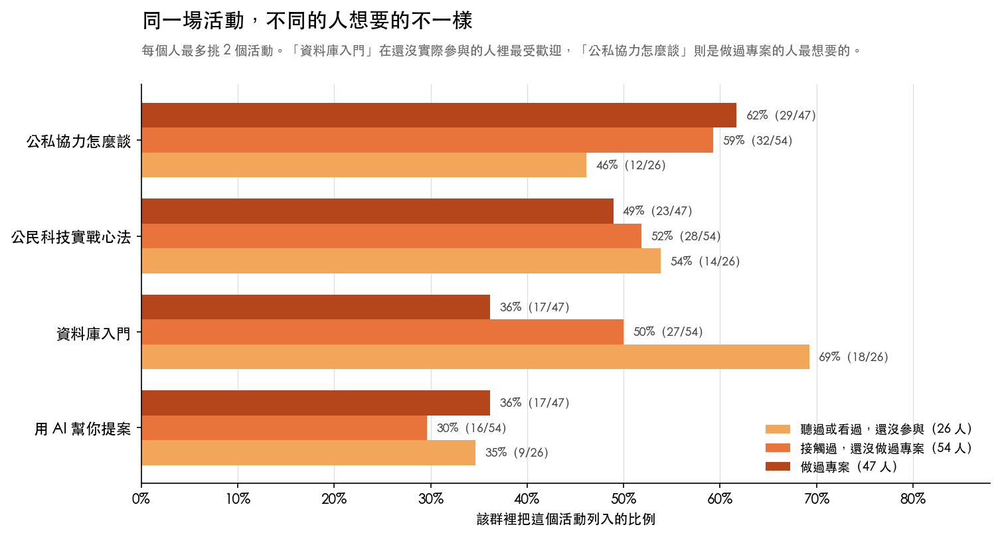

# 臺灣公民科技生態系與需求調查報告（好讀版）

提交對象：g0v 揪松團　｜　分析：鄭婷宇（Claire）
資料範圍：問卷回收至 2026/7/20，有效樣本 127 份
報告日期：2026 年 7 月

> 這是好讀版，適合初次認識這個生態系的讀者，或想快速掌握結論的人。完整數據、
> 逐條來源與限制揭露，請見[內部完整版](公民科技生態系分析報告_整合版_v1.md)。

---

## 目錄

- **壹、研究背景**
- **貳、研究摘要**：四個最值得注意的發現
- **參、研究發現**
  - 一、沒有一種身分佔到四分之一
  - 二、只做一件事的人最多
  - 三、撐住專案的人，正在被撐垮
  - 四、留下來的理由，換了一輪
  - 五、人脈是最常被用到的資源
  - 六、先讓人看懂問題，才有資源
  - 七、卡住新人的不是技術
- **肆、研究建議**：兩件事最值得先做
- **伍、反思**：每條結論的另一種解釋
- **陸、研究限制**
- **柒、怎麼驗收這份報告**
- **附錄**：名詞與分母對照

---

# 壹、研究背景

這份報告根據 g0v（台灣一個推動公民科技的開源社群）揪松團（g0v 底下負責這次調查的工作團隊）於 2026 年委託的問卷調查寫成，回收了 127 位台灣公民科技參與者、潛在參與者與出資者的回答。目的是回答兩件事：這個圈子在 2026 年年中是什麼樣子，包括誰在做、卡在哪裡、什麼讓人留下來；以及根據這些現況，接下來的內容該投入在哪裡。

公民科技，簡單說就是用科技和數位工具，讓公民社會變得更好。可能是打造一個解決方案，讓大家更容易參與公共事務、更好用公共服務；也可能是串聯社群、推動討論，用科技或開放資料改善政策、提升民主品質。這裡說的開放資料，指的是政府或機構主動公開、任何人都可以自由取用與再利用的資料。不管是做出一個工具，還是把人和議題組織起來，只要用得上科技或開放資料，都算。例如 Covid-19 期間協助大家找到口罩的「口罩地圖」，或是像 vTaiwan 那樣用線上工具讓不同立場的人一起討論政策，都是公民科技的例子。如果你想直接看看有哪些專案、找到可以加入的地方，g0v 揪松團經營的「[台灣公民科技資料庫](https://civictech.tw/)」收錄了許多可以參考的專案與行動指引。

如果你是第一次接觸公民科技，建議從研究發現的第一節讀起，先認識這群人是誰、在做什麼；如果你已經在圈子裡做專案，想知道別人卡在哪裡、有什麼資源可以用，可以直接跳到研究發現的第三節。

# 貳、研究摘要

在細看之前，先講四個從這次調查裡浮現、最值得注意的發現。

## 一、拖垮專案的是進度停滯與核心成員累垮，不是找不到夥伴

一般直覺會認為公民科技專案最大的難題是招不到夥伴。但資料顯示，最讓投入者卡住進度的前三名分別是「專案難有穩定進度」「做出來的成果很難真正發揮影響力」「核心成員累垮」，而「找不到願意一起做的夥伴」的比例明顯排在後面，只有前三名的三分之二左右。

「難有穩定進度」是什麼意思？公民科技專案多半靠大家用工作之餘的時間推進，很少有人全職。所以一個專案常見的樣子是：某段時間大家熱血衝刺、進度飛快，接著進入很長一段幾乎沒有動靜的低度運作期，有些就這樣停下來不再重啟。在這次調查中，做過專案的 47 人裡，將近三分之一在填答當下手上一個進行中的專案都沒有。

把三件事放在一起看：進度時快時慢、做出來的東西找不到真正的著力點、少數人長期硬撐，這三件事互相加乘，才是讓專案停滯、也讓人失去繼續投入意願的主因。

而且這些負擔不是平均分攤的。問卷請每個人選一句最貼近自己在公民科技圈子做的事，其中三種答案剛好排成一條線，差別在於**你對「這個專案要做什麼」有多少決定權**：

| 你在專案裡的位置 | 決定權 | 被「核心成員累垮」困住的人 |
|---|---|---|
| 加入別人發起的專案，大方向由發起的人決定 | 最小 | 8 人中有 1 人 |
| 和大家一起把問題定義清楚、一起設計解法 | 一半一半 | 18 人中有 6 人 |
| 自己起頭，發現問題、找人、把事情啟動 | 最大 | 10 人中有 6 人 |

**決定權越大的人，被累垮的比例越高。** 自己起頭的那 10 個人裡，有 6 個說核心成員累垮明顯卡住了他們的進度。這條線只在會實際動手做專案的三種位置上成立，人數更少的兩種位置（只接收資訊、主動通報）數字會上下跳動，接不成一條線，詳見研究發現第三節。

## 二、四成的人動機換過一輪，流失最多的是「對社群的歸屬感」

把人帶進來、又把人留下來的，最主要都是「認同這件事想達成的目標」。但如果只看總數，會誤以為大家的動機從頭到尾沒變。實際上四成的曾參與者，動機組合已經換過一輪。流失最多的是「對社群的歸屬感」；反而「累積作品集、練功」這種務實的理由是淨增加的。

換句話說，社群歸屬感在剛加入時也是不少人選的理由，但不像認同目標那樣持久，不足以單獨把人留住。若要維繫長期參與者，得同時提供「這件事值得做」與「我在這裡有所成長」兩種理由，詳見研究發現第四節。

## 三、擋住新人的是「不知道有哪些專案、身邊沒有人帶」，技術門檻只排第四

還沒實際參與過公民科技的人，說出的頭號原因是「不知道有哪些專案或議題」與「身邊沒有人帶，怕融不進去或幫不上忙」，接著是「不知道怎麼加入、找不到入口」。「覺得要會寫程式、技術門檻太高」只排到第四。

而在消息怎麼傳到人身上這件事上，官方管道其實觸及得不差：全體填答者裡將近三分之二至少接上了一個官方管道。但**光是收得到消息，不等於知道可以做什麼、有人可以問**。而且有接近四分之一是只透過認識的人收到消息、沒有接上任何官方管道的，這群人在官方管道的觸及數字裡看不見，詳見研究發現第七節。

## 四、想拿到資源，先把問題講清楚；出資端認為最難找資源的是「還只有想法」的階段

曾經出錢支持過公民科技專案的有 27 人。問他們決定要不要支持一個專案時最看重什麼，排在最前面的兩項都跟「這件事本身值不值得做」有關：**問題夠重要而且講得夠清楚**，以及呼應自己關心的議題。團隊的能力與信譽、看得到的影響，都排在後面。

再問他們觀察到哪個階段的專案最難找資源，過半的人指向「還在很早期、只有想法」的階段。這兩件事合起來是一個對提案者實用的訊號：**最缺資源的時候，剛好也是最需要把問題說明白的時候**，因為那個階段能拿出來說服人的往往就只有問題本身。

要提醒的是，這 27 人裡有 26 人自己就在這個圈子裡，所以這是一群圈內出資者的看法，不代表基金會、企業或政府等圈外資助者怎麼想，詳見研究發現第六節。

# 參、研究發現

接下來，從這群人是誰開始說起。

## 一、沒有一種身分佔到四分之一

**127 位填答者分散在各行各業，最大的身分類別也只佔兩成。**

回收的 127 份填答，大致可以分成三種人：**還沒接觸過公民科技的人**（26 人，只聽過或看過，沒實際碰過）、**接觸過但還沒做過專案的人**（54 人，知道這個圈子，但沒有實際參與過任何專案）、**做過專案的人**（47 人，真的動手參與過至少一個公民科技專案）。後面談到「卡住了什麼」「什麼讓人留下來」這類題目時，多半只有這 47 人回答過，因為那些題目問的是具體的專案經驗，還沒做過專案的人答不了。

先看這 127 人的基本樣子。年齡集中在 31 到 50 歲之間，20 歲以下的人很少見；性別上男性略多於女性，另有一小群選擇其他或不願透露：

| 這群人的基本樣子 | 比例 |
|---|---|
| 31–40 歲 | 35%（45/127） |
| 41–50 歲 | 29%（37/127） |
| 20 歲以下 | 5.5%（7/127） |
| 男性 | 50%（64/127） |
| 女性 | 41%（52/127） |
| 其他或不願透露 | 9%（11/127） |

**身分背景相當分散：自由工作者與非營利組織工作者並列最多，各佔兩成，但沒有一種身分佔到四分之一。** 學校或研究機構、企業或新創緊接在後，學生與公部門背景的人相對少一些：

| 身分背景 | 比例 |
|---|---|
| 自由工作者 | 20%（25/127） |
| 非營利組織工作者 | 20%（25/127） |
| 學校或研究機構 | 16%（20/127） |
| 企業或新創 | 16%（20/127） |
| 學生 | 13%（17/127） |
| 公部門 | 8%（10/127） |

願意進一步說明所屬組織的 55 人裡，非營利組織與協會佔最多，其次是學術與研究機構、企業與新創。組織這一題的最大類別略高於四分之一，但同樣沒有任何一類佔到三分之一。兩種分法都指向同一件事：關心公民科技的人分散在很不一樣的職業與組織裡，不是集中在特定行業。

**居住地上，雙北（台北市與新北市合稱）合計超過六成**，中南部與東部合計約兩成二。這個比例值得小心解讀：問卷透過 g0v 相關管道發放，而 g0v 的實體活動長期集中在台北，六成住雙北很可能是取樣造成的結果，不能直接推論成「中南部沒有公民科技社群」。

不過只看居住地，會低估這群人實際觸及的地理範圍。問卷另外問了「除了居住地，你還跟哪些地區有比較深的連結」，63 人填答了這一題，超過半數提到中南部或東部的地名，也有一部分人提到海外。即使是住在雙北的人裡，也有不少同時與中南部或東部有深度連結、或與海外有連結。也就是說，這群人雖然居住地集中在雙北，但他們本身的人際網絡連向更廣的地方，規劃地方場次時，不必然要在當地重新找人，也可以從既有參與者的地緣連結出發。

**公民科技不等於 g0v。** 全體填答者裡接近半數從來沒參加過任何 g0v 活動；更關鍵的是，做過專案的 47 人裡，也有超過四分之一從未參加過 g0v 活動。而在「你從哪裡得知公民科技相關資訊」這題，選「非營利組織」的人比選「開源社群（含 g0v）」的還多。這說明 g0v 是這個生態系裡很重要的節點，但不是唯一入口。如果只用「參加過幾次 g0v 活動」來判斷一個人有多投入公民科技，會漏掉不少實際做過專案、卻沒怎麼接觸 g0v 的人。

## 二、只做一件事的人最多

**46 人只勾一種角色，只有 10 人身兼五種。**

### 2.1　公民科技社群裡有哪些角色，大家怎麼跨在不同角色上

問卷請每個人回想自己在公民科技專案裡擔任過哪些角色，這題可以複選，因為同一個人常常身兼多職，例如可以同時是發起專案的人，也是實際動手把東西做出來的人。填答這題的是**曾接觸公民科技的 101 人**（54 位接觸過但還沒做過專案的人，加上 47 位做過專案的人）。各角色的勾選比例，使用過某個工具或參與過討論的人最多，接著依序是協助落地應用或推廣、參與籌備開發設計或維護、發起專案，出錢或調度資源的人最少：

| 角色（可複選） | 勾選比例 |
|---|---|
| 使用過某個工具或參與過討論 | 89%（90/101） |
| 協助落地應用或推廣 | 48%（48/101） |
| 參與籌備開發設計或維護 | 33%（33/101） |
| 發起專案 | 28%（28/101） |
| 出錢或調度資源 | 17%（17/101） |

這個由多到少的排序容易被誤讀成「一層一層往上爬」，但它不是漏斗，只是五種角色各自的普及率。因為角色是複選，勾了比較深的角色不代表也勾了比較淺的，例如勾「發起專案」的人裡，只有八成多也勾了「使用過某個工具」。

**真正值得注意的是身兼多職的程度。** 只勾一種角色的有 46 人；勾滿全部五種角色的只有 10 人。這個圈子裡有一大群人只固定做一件事，也有一小群人幾乎什麼都做，中間的分布並不平均。而且參與越深的人，同時扮演的角色種類通常也越多，這兩件事其實是同一個現象的兩面。

- 這個發現也可能有別的解釋：那 46 位只勾一種角色的人裡，多數勾的都是門檻最低的「使用過某個工具或參與過討論」，也有不少人參與深度只到「接收資訊」。所以「只做一件事」在很大程度上可能等於「參與還很淺」，未必是「這個人專職負責某一種工作」。
- 還有一個容易被忽略的組合：動手做專案的人，不一定用過別人的公民科技產品。發起專案或參與籌備開發的人裡，有一小部分沒有勾過「使用過某個工具」。要注意這只代表他們沒用過圈內既有的產品，不能從這裡推論他們懂不懂自己專案的使用者。

除了角色，問卷還問了每個人「哪一句最貼近你在公民科技圈子做的事」，這題只能選一個，答案由淺到深排成一條線，差別在於對專案方向的決定權多寡：接收資訊、主動通報、協力參與、共創解法、發起專案。在這 101 人裡，**最淺的「接收資訊」就佔了四成**，其餘四個位置各在一成到兩成之間，而且不是逐級遞減的階梯，共創解法那一級比它前面的協力參與還多。

### 2.2　最近參與的專案走到哪個階段

**這份問卷用兩種鏡頭看同一群人。** 一種是整體經驗，問的是「你做過哪些角色」「哪一句最貼近你實際在做的事」「第一次投入時最打動你的是什麼」，這些問題不綁定任何特定專案，回答的是一個人在這個生態系裡累積下來的樣子，也就是前面談的內容。另一種是最近一次的那個專案：問卷中段請每位填答者想著最近參與的那一個專案回答，接著問那個專案在做什麼、走到哪個階段、用過哪些資源、遇到哪些困難，這是接下來幾節要談的內容。兩種鏡頭各自成立，但要跨著用就得小心：一個人在圈子裡通常是發起者，不代表他最近參與的那個專案裡他也是發起者。本報告只在第三節的 3.3「決定權越大的人，越容易被累垮」跨鏡頭讀，理由是主導性高的人參與頻率通常也高，自己起頭的專案往往就是他手上一直在跑的那一個，所以對這群人來說兩個鏡頭多半重合；這是依社群實務做的判斷，問卷沒有直接問過，無法用資料驗證。

**做過專案的 47 人，填答當下專案走到哪個階段也不一樣。** 落地（東西已經做出來，正在設法讓它真的被用到）佔比最高，接著是維運、早期、已停擺。近三分之二的人手上的專案，已經走過最初的開發階段，正在面對「怎麼落地」與「怎麼維運」這兩關：

| 專案階段 | 比例 |
|---|---|
| 落地（已做出成果，正努力讓它被用到） | 36%（17/47） |
| 維運（持續運作、長期經營） | 28%（13/47） |
| 早期（還在探索問題或開發中） | 23%（11/47） |
| 已停擺 | 13%（6/47） |

47 位曾參與者也各自用一句話描述了最近參與的專案是為了解決什麼問題。人工歸類後，最多人的主題是環境與生態，其次是散落在單一類別之外的「其他」（包含居住、醫療、能源、數位身分等彼此不相鄰的題目），接著是教育與學習、社群經營與協作工具、防災與公共安全。有 15 人的專案需要跟公部門打交道，這和第七節談到的「公私協力怎麼談」活動需求最高互相對得上。要提醒的是，這 47 筆描述彼此獨立填答，不同人可能描述的是同一個專案，問卷沒有問專案的正式名稱，沒辦法分辨這些描述裡有沒有重複，因此不知道這 47 筆實際對應幾個相異的專案。

## 三、撐住專案的人，正在被撐垮

**自己起頭的 10 個人裡，有 6 個人說核心成員累垮明顯卡住了進度。**

### 3.1　什麼卡住了專案

這一節的資料只有 47 位做過專案的人回答。問卷列出 13 種在公民科技專案裡常見的困難，請他們逐項評分，評的是「這件事對你造成多大的困擾」，不是「這件事有沒有發生」。

- 五個等級依序是：幾乎沒影響、有點困擾但還能處理、明顯卡住我拖慢進度、受挫到萌生退意、困擾到專案無法持續。
- 因為問卷沒有「沒遇到」這個選項，評 1 分的人可能是真的沒發生過，也可能是發生了但不影響他，兩者分不開。所以本報告不用平均分比較嚴重程度，改看「3 分以上」（明顯卡住進度）與「4 分以上」（嚴重到讓人想退出）各有多少人。

| 排名 | 困難 | 3 分以上 | 4 分以上 |
|---|---|---|---|
| 1 | 專案難有穩定進度，容易停滯 | 38%（18/47） | 13%（6/47） |
| 2 | 做出來的成果很難真正發揮影響力 | 36%（17/47） | 13%（6/47） |
| 3 | 核心成員累垮，常常一個人撐住整個專案 | 32%（15/47） | 13%（6/47） |
| 4 | 找不到願意一起做的夥伴 | 23%（11/47） | 9%（4/47） |
| 5 | 公務員不信任你、不願給你需要的資訊 | 19%（9/47） | 9%（4/47） |
| 6 | 專案要改變方向或對外代表時，不確定誰有權責拍板 | 17%（8/47） | 0%（0/47） |
| 7 | 參與者突然消失，留下大量未完成任務 | 15%（7/47） | 2%（1/47） |
| 7 | 找不到對接的政府窗口、發訊息沒人理 | 15%（7/47） | 4%（2/47） |
| 9 | 抓不準專案到底要解決什麼問題 | 13%（6/47） | 4%（2/47） |
| 9 | 專案缺少文件或交接，人一走知識就斷了 | 13%（6/47） | 4%（2/47） |
| 9 | 想要的資料拿不到、不知道去哪要 | 13%（6/47） | 9%（4/47） |
| 12 | 新手或不會寫程式的人，不知道能幫什麼 | 11%（5/47） | 4%（2/47） |
| 13 | 拿到經費後不知道怎麼管帳、報稅或處理聘僱 | 6%（3/47） | 0%（0/47） |

**前三名是進度停不住、成果沒有著力點、少數人硬撐，而一般最容易想到的「找不到願意一起做的夥伴」排在第四。** 這三件事會互相加乘：節奏斷掉讓成果遲遲出不來，成果出不來就更難證明值得投入，於是更少人願意接手，最後又回到少數人身上。前三名各有 6 個人被困到萌生退意的程度，這些人不一定是同一批，但可以看出這三種困難不只是麻煩，而是真的會把人逼到想放棄。

### 3.2　「進度停不住」是所有位置的人都會遇到的

把 47 人依他們在圈子裡的位置分成五組，再看「專案難有穩定進度」這一題，各組的比例相當接近，沒有哪一組特別高或特別低。其他困難多半集中在特定的人身上，但進度停滯是整個生態系共通的問題，不是某一種角色的處境。這五組人數在 5 到 18 人之間，比例接近也可能只是小樣本下的巧合，需要更大的樣本才能確認。

### 3.3　決定權越大的人，越容易被累垮

其他兩個排在前面的困難就不是這樣了。問卷請每個人選一句最貼近自己在公民科技圈子做的事，其中三種答案剛好排成一條線，差別在於對專案要做什麼有多少決定權：

| 你在專案裡的位置 | 核心成員累垮 | 成果難發揮影響力 |
|---|---|---|
| 加入別人發起的專案，大方向由發起的人決定 | 8 人中有 1 人 | 8 人中有 1 人 |
| 和大家一起把問題定義清楚、一起設計解法 | 18 人中有 6 人 | 18 人中有 8 人 |
| 自己起頭，發現問題、找人、把事情啟動 | 10 人中有 6 人 | 10 人中有 5 人 |

兩個困難都隨著決定權變大而升高。這條線只在這三種位置成立，人數更少的兩種位置（只接收資訊 5 人、主動通報 6 人）數字上下跳動，接不成一條線，所以這裡不把整條五級的線畫成一路上升。

- 這個發現也可能有別的解釋：決定權大的人本來就承擔比較多事情，被累垮的比例高不一定是因為位置本身讓人累，也可能是因為會走到那個位置的人，原本就是願意扛比較多的那種人。這份問卷是同一個時間點的橫斷面調查，沒有辦法分辨這兩種情況。

### 3.4　站在決策位置的人，看不見新手的困境

反過來看「新手或不會寫程式的人，不知道能幫什麼」這一題，比較有感的反而落在淺的那一頭：主動通報、只接收資訊的人感受較明顯；共創解法那 18 個人裡則是一個都沒有；發起專案的人又稍微回升。這條線不是一路往下，所以只能說重心偏向淺的位置，不能說它和上一小節那條線正好相反。這代表如果要規劃「怎麼讓新手參與」的內容，光去問發起專案的人可能問不出來，因為那不是他們會遇到的困難。這幾組各自是 5 到 18 人的小群體，適合當作規劃內容時的提醒，不是定論。

### 3.5　他們實際做了什麼

問卷另外問了「面對這些困難，你有採取什麼行動去解決嗎」，這題是選填，28 人回答：

| 採取的行動 | 人數 |
|---|---|
| 向外求助：找人脈、專家或在地組織 | 6 |
| 降低期待、放慢步調 | 5 |
| 自己補能力或用工具頂著 | 4 |
| 團隊內部溝通、建立固定節奏 | 4 |
| 對外推廣、擴大能見度 | 4 |
| 沒有特別行動或尚未行動 | 3 |
| 只描述困難，沒有提到行動 | 3 |
| 建立文件、避免交接斷層 | 1 |
| 交棒或淡出 | 1 |

最常見的兩種應對，方向完全相反：一種是向外求助，另一種是降低期待、放慢步調（用詞相當一致，像是「佛系經營」「慢慢做即可」「只能靠慢慢累積」）。加上「沒有特別行動」與「只描述困難沒提行動」，28 位填答者裡有 11 人屬於沒有主動處理或主動降低期待。

這對規劃內容有直接的意義：社群自己摸索出來的解法，集中在「找對的人」和「建立節奏」這兩件事上。而「佛系」多半不是一種策略，是撐不下去時的合理反應。如果方法論的內容能把「向外求助」的具體做法寫清楚，例如該找誰、怎麼開口、拿什麼交換，或許能接住這 11 人。這是從資料延伸出來的推論，不是資料本身的發現，問卷並沒有問過這些人「如果有這樣的內容你會不會用」。這一題只有 28 人填答，而且願意寫下自己怎麼應對的人，本來就可能是比較願意分享、也比較主動的那一群，所以這個分布不能代表全部 47 人。

## 四、留下來的理由，換了一輪

**四成的人動機組合換過一輪，社群歸屬感的留存率偏低。**

問卷分別問了 47 位曾參與者「第一次投入時最打動你的是什麼」與「現在還讓你留下來的是什麼」，兩題都是複選，題目請大家挑最打動自己的，多數人勾 1 到 2 項：

| 動機 | 投入的動機 | 持續參與的動機 | 留存率 |
|---|---|---|---|
| 認同這件事想達成的目標 | 39 人 | 39 人 | 92% |
| 認同這個社群，想成為一員 | 20 人 | 17 人 | 70% |
| 純粹覺得好玩、有趣 | 16 人 | 15 人 | 81% |
| 想認識新朋友、找到同好 | 13 人 | 15 人 | 92% |
| 身邊有人在做，跟著加入 | 12 人 | 12 人 | 67% |
| 累積作品集、練功或建立好名聲 | 6 人 | 9 人 | 83% |

這裡的「留存率」指的是**動機**的留存率：同一個人前後兩次都選了同一個動機的比例，不是指這個人有沒有留在社群裡。這 47 位填答者現在都還在圈子裡，已經完全離開的人不會來填這份問卷，所以我們沒有辦法知道「哪一種動機真的留住了誰」。

單看第一次與現在的總人數，會誤以為大家的動機幾乎沒變，例如「認同目標」都是 39 人。但逐人比對後發現，**四成的曾參與者，動機組合其實換過**，只是換進換出剛好讓總數看起來很穩定。

- 「認同這個社群、想成為一員」的**留存率是所有動機裡第二低的**：20 人裡有 6 人後來不再選它。
- **留存率真正最低的是「身邊有人在做，跟著加入」**：12 人到 8 人，留存率 67%。但社群歸屬感的絕對流失人數最多，這兩件事看的是不同的東西：留存率看的是比例，流失人數看的是絕對數字。
- 「身邊有人在做，跟著加入」的人裡，有 4 人後來換了理由，人際帶進來的人似乎最需要在中途找到自己的理由。
- 「累積作品集、練功」是唯一淨增加的動機，從 6 人變成 9 人，這是比較務實的長期誘因，不是社群常自我期許的那種熱情。

換句話說，社群歸屬感在剛加入時也是不少人選的理由，但不像認同目標那樣持久，不足以單獨把人留住。若要維繫長期參與者，得同時提供「這件事值得做」與「我在這裡有所成長」兩種理由。

把曾參與者依年齡分成三群（30 歲以下、31 到 40 歲、41 歲以上）再看一次現在的動機，會看到一些差異：年輕世代選「累積作品集、練功」的比例明顯偏高；41 歲以上則是「認同目標」一枝獨秀，其餘理由都不突出；「純粹覺得好玩」與「認同這個社群」在年長世代的比例明顯偏低。這三個年齡層各自是 10 到 19 人的小群體，適合當作觀察的起點，後續樣本增加後值得再確認一次。而且這是同一個時間點的橫斷面資料，不是真正追蹤同一群人隨時間改變，不能說是「某個年齡層的人被什麼留住了」，只能說「不同年齡層現在選的理由不一樣」。

## 五、人脈是最常被用到的資源

**66% 的曾參與者用過人脈，比用過經費的 47% 還多。**

### 5.1　他們手上有什麼

問卷問了 47 位曾參與者「這個專案從開始到現在，曾使用過哪些資源」，可以複選：

| 資源 | 用過的比例 |
|---|---|
| 人脈（例如由社群介紹可諮詢的專家） | 66%（31/47） |
| 經費（獎助金、標案或機構支持費用） | 47%（22/47） |
| 公開資料或開放資料 | 45%（21/47） |
| 場地 | 40%（19/47） |
| 現成的數位工具或平台 | 36%（17/47） |
| 政府窗口 | 34%（16/47） |
| 主要靠自己想辦法 | 23%（11/47） |

**在這次調查裡，人脈比錢更常被用到。** 這和一般想像的「公民科技最缺的是經費」不太一樣。不過要注意，這題問的是「用過哪些」，不是「哪些最難拿到」，用得多也可能只是因為人脈相對容易取得，不代表它不重要或不稀缺。

### 5.2　真正投進專案的專長，寫程式只佔不到三成

問卷也問了這 47 人在專案裡主要的專長或負責的事，可以複選：

| 專長或負責的事 | 比例 |
|---|---|
| 議題研究 | 51%（24/47） |
| 專案管理 | 51%（24/47） |
| 行銷推廣 | 45%（21/47） |
| 行政與後勤 | 40%（19/47） |
| 文案撰寫 | 38%（18/47） |
| 寫程式 | 28%（13/47） |
| 活絡氣氛與關係維繫 | 23%（11/47） |
| 體驗設計 | 17%（8/47） |
| 視覺設計 | 15%（7/47） |

這是一個對新人很重要的訊息。第七節會看到，還沒實際參與的人裡有不少把「覺得要會寫程式、技術門檻太高」當成沒有加入的原因之一。但從實際做過專案的人這邊看，真正在專案裡負責寫程式的不到三成，更多人做的是把議題研究清楚、把專案管起來、把事情推廣出去、把文件寫好。**一個公民科技專案需要的專長，比多數人以為的更廣。**

要說明的是，這題問的是「在這個專案裡你負責什麼」，不是「你會什麼」。一個會寫程式的人，在那個專案裡也可能主要在做專案管理。

### 5.3　多數人每個月投入的時間不到五小時

問卷也問了過去 30 天大約花了多少時間在這個專案：1 到 5 小時最多，接著是 6 到 20 小時與幾乎沒有並列，21 小時以上的人也占了一定比例。把「幾乎沒有」與「1 到 5 小時」加起來，超過半數的人一個月投入不到 5 小時。這正好對應第三節那個排名第一的困難：專案難有穩定進度。當一個專案的參與者多半是用工作之餘的零碎時間推進，進度會時快時慢就不是意外，而是這種投入結構的自然結果。

另一頭也值得注意：有兩成一每個月投入 21 小時以上，等於接近一份兼職。這個圈子同時存在「偶爾參與」與「幾乎全職投入」兩種很不一樣的人。

## 六、先讓人看懂問題，才有資源

**27 位出資者最看重的是問題講得夠不夠清楚。**

### 6.1　出資端怎麼評估一個專案

問卷裡有 27 人表示曾經為公民科技專案提供過經費方面的支持，這一節是他們的回答。這一題單獨問全體 127 人，和角色題裡的「出錢或調度資源」是不同的題目（兩群人只有 12 人重疊，詳見附錄）。27 人是一個小樣本，以下呈現的是這群出資者的傾向，適合當作理解出資端的起點。

**這 27 位出資者幾乎都是圈內人。** 其中 20 人自己就做過公民科技專案、6 人接觸過但還沒做過專案，只有 1 人屬於只聽過或看過、還沒實際碰過的那一層。這份調查撈到的資金，多半來自已經在這個圈子裡的人，而不是圈外的資助者。但這件事要特別小心解讀：問卷是透過 g0v 及相關社群管道發放的，能填到問卷的出資者本來就會是圈內人，所以這個比例極可能是取樣造成的，**不能推論成台灣公民科技的資金結構就是這樣**。它能說明的只有一件事：這裡呈現的出資端觀點，是一群圈內出資者的觀點，不代表基金會、企業或政府等圈外資助者怎麼看。

**先看他們怎麼評估一個專案值不值得支持**（最多選 3 個）：

| 評估時最看重的 | 人數 |
|---|---|
| 它要解決的問題夠重要、而且講得夠清楚 | 16 人 |
| 呼應我自己關心的議題 | 14 人 |
| 團隊或發起人的能力和信譽 | 12 人 |
| 預期能產生看得到、而且能被衡量的影響 | 12 人 |
| 專案有長期維持下去的規劃 | 11 人 |
| 當時剛好有預算或資源 | 7 人 |

排在最前面的兩項都跟「這件事本身值不值得做」有關，而不是團隊有多強或成果有多漂亮。**「問題講得夠清楚」排第一，某種程度上是一個可以行動的訊號**：把問題說明白，比先把成果做漂亮更早被看見。

### 6.2　他們認為哪個階段最難找資源

27 人的答案是：還在很早期、只有想法的最多，其次是已經上線要長期維運的，而已經做出原型、要往落地走的最少。

**在出資端眼中，資源最難找的是「還只有想法」的時候。** 這和前面的評估準則是一致的：他們最看重「問題講得夠重要、講得夠清楚」，而在只有想法的階段，能拿出來說服人的往往就只有問題本身。換句話說，早期專案最缺的資源，可能同時也是最需要把問題說明白才拿得到的資源。

要提醒的是，這 27 人回答的是他們自己觀察到的難易程度，不是提案端實際的處境。這份問卷沒有問提案端「你在哪個階段最難找到資源」，所以無法拿兩邊直接對照。

## 七、卡住新人的不是技術

**不知道有哪些專案、身邊沒人帶，才是新人卡住的地方。**

### 7.1　這個圈子的入口在哪、斷在哪

這一節要問兩個問題：消息是怎麼傳到人身上的，以及還沒接觸過的人為什麼還沒踏進來。

問卷問了全體 127 人主要透過哪些管道得知 g0v 的活動消息，可以複選。單一選項裡排最前面的兩個是 g0v 的社群帳號（Facebook、Threads、Instagram）與親友推薦，兩者比例相近；接著是 g0v 的 Slack、揪松團每月電子報、揪松團 LINE 群組。另外有一小部分表示「都沒有，我之前不太清楚這些管道」。

不過把單一個官方帳號拿來跟親友推薦比，會高估人際管道的份量。把社群帳號、Slack、電子報、LINE 群組等官方經營的管道合起來算，同一個人不管勾了其中幾個都只算一次：

| | 至少用到一個官方管道 | 有靠親友推薦 |
|---|---|---|
| 全體 127 人 | 65%（83/127） | 40%（51/127） |
| 做過專案的 47 人 | 72%（34/47） | 47%（22/47） |

**官方管道觸及到的人明顯比親友推薦多。** 這和「這個圈子主要靠人際網絡傳播」的印象不太一樣。但這兩欄會互相重疊，真正要問的是：有多少人是只靠親友推薦、沒有接上任何官方管道的？把 127 人拆成互斥的四組：

| 這個人怎麼收到消息 | 全體 127 人 | 做過專案的 47 人 |
|---|---|---|
| 只有官方管道 | 48%（61/127） | 51%（24/47） |
| 官方與親友都有 | 17%（22/127） | 21%（10/47） |
| **只靠親友推薦，沒有任何官方管道** | **23%（29/127）** | **26%（12/47）** |
| 兩者都沒有 | 12%（15/127） | 2%（1/47） |

**接近四分之一的人，是只透過認識的人收到消息的。** 這群人如果只看官方管道的觸及數字，會完全看不見。對經營者來說，這是官方管道再怎麼加強也接不到的一群，只能靠既有參與者往外帶。

另外值得注意的是：在做過專案的 47 人裡，「兩者都沒有」只剩 1 人，但在全體裡有 15 人。已經動手做過專案的人，幾乎都有接上某條線。

兩個提醒。第一，這題問的是現在主要透過哪些管道得知活動消息，不是當初怎麼入坑的，兩者不能混為一談。第二，這份問卷本身就是透過這些管道發放出去的，填得到這份問卷的人，本來就比較可能是這些管道觸及得到的人，所以「兩者都沒有」那一組在真實世界裡只會更多，不會更少。

### 7.2　主要的門檻是「不知道有哪些專案」與「沒有人帶」

再看還沒實際參與過的 26 人，問卷問「你聽過或看過公民科技，但還沒真正參與，最主要的原因是什麼」，題目請大家最多選 3 個原因，26 人全數作答：

| 還沒參與的原因 | 比例 |
|---|---|
| 不知道有哪些專案或議題可以參與 | 62%（16/26） |
| 身邊沒有人帶、怕融不進去或幫不上忙 | 54%（14/26） |
| 不知道怎麼加入、找不到入口 | 50%（13/26） |
| 覺得要會寫程式、技術門檻太高 | 35%（9/26） |

**排前面的三個原因都跟「資訊」與「有沒有人帶」有關，不是「能力夠不夠」的問題。** 技術門檻只排到第四，比前三個原因都低。

- 這個發現也可能有別的解釋：題目問的對象是「聽過或看過公民科技、但還沒真正參與」的人，不是完全沒聽過的一般大眾。已經聽過的人會說卡在「不知道有哪些專案」，是因為他們早就跨過了「知道有這件事」那一關；對從來沒聽過的人來說，門檻可能落在完全不同的地方，這份問卷接觸不到他們。

把這一題和前面的管道資料放在一起看，會得到一個比較完整的說法：官方管道其實觸及得不差，六成五的填答者至少接上一條；但**光是「收得到消息」不等於「知道可以做什麼、有人可以問」**。還沒踏進來的人卡住的地方，是不知道有哪些專案、身邊沒有人帶、找不到入口，這三件事都不是多發一則貼文就能解決的。而另外有接近四分之一的人根本不在官方管道的射程內，只透過認識的人收到消息。

### 7.3　入門型與深度型的活動，服務的是不同的人

問卷也問了大家想參加什麼樣的活動，把三種人分開看，喜好會反過來：「資料庫入門」在還沒接觸的人裡最受歡迎，在做過專案的人裡排得比較後面；「公私協力怎麼談」正好相反，在做過專案的人裡最高，在還沒接觸的人裡比較低。辦活動時分開設定對象，可能比把兩種需求混在同一場裡更有效。這裡「還沒實際參與」那一層是 26 人的小群體，型態值得後續再確認。

# 肆、研究建議

## 一、兩件事最值得先做

**讓人找得到專案，把成果如何落地寫清楚。**

前面的研究發現講的是現況，這一章把它們接到「該投入什麼」上。

### 1.1　怎麼決定哪些內容值得先做

問卷用的是狩野模型（Kano model）的成對問法，這是一種常用來排內容或功能優先順序的方法：對每一個主題，先問「如果有這樣一篇文章，你的感覺如何」，再問「如果沒有，你的感覺如何」。把兩題的答案交叉後，可以把主題分成四種：

- **魅力型**：有了會驚喜，沒有也不會抱怨。屬於加分項。
- **期望型**：有了滿意度線性上升，沒有會明顯失望。投資報酬最穩定。
- **基本型**：有了覺得理所當然，沒有會不滿。屬於門檻，不做像是缺漏。
- **無差別**：有沒有都無感。優先度最低。

這樣分的用意，是避免只用「多少人說想看」來排序。想看的人多，不代表沒有就會被抱怨；反過來，有些主題勾選率不高，卻是沒有就說不過去的基本盤。

**五個候選的方法論主題，全部落在「魅力型」，沒有任何一個是「基本型」。**

| 主題 | 落點 |
|---|---|
| 怎麼讓做好的東西真正落地、接進體制 | 魅力型（最接近期望型） |
| 怎麼留住夥伴、維持團隊運作的能量 | 魅力型 |
| 沒有現成資料時，怎麼搜尋、整理或自建資料集 | 魅力型 |
| 怎麼捲動更多人（包含不會寫程式的人）一起參與 | 魅力型 |
| 如何發起一個公民科技專案 | 魅力型 |

**全部落在魅力型這件事本身就是一個結論**：這些內容寫了都會讓社群覺得有價值，但在填答當下都還不到「不寫會被抱怨」的程度。這代表內容規劃有相當大的空間：不必急著補某個非做不可的缺口，而是可以挑最能加分的先做。

其中「**怎麼讓做好的東西真正落地、接進體制**」明顯最強，是五個主題裡爭議最小的首選。這一點和研究發現第三節對得起來：成果難發揮影響力是曾參與者困擾排行的第二大困難。狩野這一題問的是另一群人，和困擾題的 47 人是不同樣本，兩個各自獨立的發現，指向同一個地方。

把三群人分開看，還有一個值得注意的差異：「怎麼捲動更多人參與」和「怎麼留住夥伴」這兩個主題，對還沒實際參與的人來說落在「無差別」，但對另外兩群人都是「魅力型」。**還沒動手做過專案的人，感受不到團隊經營的痛。** 這 26 人是一個小群體，這個差異適合用更大的樣本再確認一次。

### 1.2　大家想看哪些領域與工具

除了方法論，問卷也問了想看哪些議題領域的資料清單與哪些跨領域工具的介紹：

- **跨領域工具**（前四名）：群眾協力與通報工具、AI 應用、資料視覺化工具、地理資訊與地圖工具。
- **議題領域**（前四名）：政府預算決算與標案、地方發展與地方創生、防災與災害應變、假訊息與詐騙防治。

這裡有一個容易被忽略的比較基準：兩題的選項數與可勾數都不一樣（工具題 7 選 3、領域題 16 選 5），勾選率不能直接拿來互比。所以工具的比例看起來比領域高，不代表工具的需求比領域強，只能各自看同一題內部的排序。這份清單問的是閱讀偏好，不是填答者實際投入的領域，規劃內容時兩者要分開看。

### 1.3　把前面的發現接到內容規劃上

前面幾節看到的困難，可以依一個人走進公民科技的歷程排出來：

| 走到哪一段 | 卡住的地方 | 這一段的人需要什麼 |
|---|---|---|
| 還沒進來 | 不知道有哪些專案或議題可以參與、不知道從哪裡加入 | 一個看得到全貌、能找到入口的地方 |
| 想進來但沒人帶 | 身邊沒有人帶、怕融不進去或幫不上忙 | 有人可以問、可以跟著做的場合 |
| 開始動手做 | 五個方法論主題全部落在魅力型，其中「怎麼讓成果真正落地」最強 | 把別人怎麼做的經驗寫成可以照著走的內容 |
| 做的過程中 | 不知道去哪找資料與工具 | 各領域、各類工具有哪些現成資源的整理 |
| 一路上都會遇到 | 進度停滯、成果難發揮影響力、核心成員累垮 | 怎麼維持節奏、怎麼分攤負荷的經驗 |

**兩件事最值得先做。**

第一是**讓人找得到專案**。擋住新人的頭號原因是不知道有哪些專案或議題可以參與，而不是能力不夠。g0v 揪松團經營的[台灣公民科技資料庫](https://civictech.tw/)本來就在做這件事，收錄了可以參考的專案與行動指引。這一段的重點不是再多做一個地方，而是既有的內容要能被還沒進門的人找到、看得懂、知道從哪裡接上。

第二是**把「成果如何落地」寫清楚**。這是五個方法論主題裡最強的一個，也對應到曾參與者困擾排行第二大的困難「做出來的成果很難真正發揮影響力」。一個題目在需求排序和實際困難上同時排在前面，代表它不是單一題目的雜訊。

需要說明的是，這份調查測的是哪些主題最值得投入，不預設要新寫還是改寫既有內容。狩野的成對問法測的是「有這篇和沒這篇」之間的感受落差，正好適合用來判斷一個主題值不值得投入心力。

至於「身邊沒有人帶」這一項，資料只告訴我們它是第二大的門檻，沒有告訴我們什麼形式能解決它。辦活動是一種可能，但活動通常也是在講「可以怎麼做」，未必能提供「有人帶」的關係。真正對應到這個需求的可能是配對、陪伴、或讓新手有明確任務可以接手的機制，這需要另外設計與驗證，不在這份調查的範圍內。

### 1.4　如果你想支持這個生態系

如果你是可能提供資源的一方，這份調查有幾件事值得參考：

- **早期的專案最難找到資源，這是出資端自己的觀察。** 過半的出資者認為「還在很早期、只有想法」的階段最難找資源。如果你想支持這個生態系，這是一個現成的切入點：越早期的支持越稀缺，也越可能決定一個構想有沒有機會長出來。
- **支持的形式不只有錢。** 人脈是最常被用到的資源，比經費還多。介紹一位可以諮詢的專家、幫忙接上一個政府窗口、提供一個開會的場地，在這份資料裡都是實際被用到的支持形式。
- **注意那些撐住專案的人。** 決定權越大的人被累垮的比例越高，自己起頭的 10 個人裡有 6 個說核心成員累垮明顯卡住了進度。而社群歸屬感的留存率是所有動機裡第二低的。這兩件事加起來，代表長期支持一個專案時，除了看成果，也值得看看撐著它的那幾個人還撐不撐得住。
- **問題講得夠清楚，比成果做得漂亮更早被看見。** 這是出資端自己說的：評估一個專案時最看重的是「它要解決的問題夠重要、而且講得夠清楚」，排在團隊信譽和可衡量的影響之前。

# 伍、反思：每條結論的另一種解釋

前面每一節談到主要發現時，都在原地附上了另一種可能的解釋。這一章把它們集中列出來，方便查核，也方便判斷哪些結論可以放心引用、哪些只能當方向。

- **決定權越大的人，被累垮的比例越高。** 也可能是選擇效應：會走到決定權大的位置的人，本來就是願意扛比較多的那種人。這條線也把「在圈子裡的位置」與「最近那個專案的困擾」放在一起看，前提是主導性高的人參與頻率也高、兩者多半指向同一個專案，這個前提本身無法用資料驗證。
- **將近半數只擔任一種角色。** 那 46 人裡多數勾的是門檻最低的「使用過某個工具」，也有不少人參與深度只到「接收資訊」。「只做一件事」可能主要反映參與還很淺，不是分工穩定。
- **進度停滯不分位置，是生態系共通的問題。** 這一題的五組人數在 5 到 18 人之間，比例接近也可能只是小樣本下的巧合，不必然代表真的均勻。
- **站在決策位置的人看不見新手的困境。** 也可能是題目理解差異：決策位置的人可能把這題讀成「我自己知不知道能幫什麼」，而不是「新手知不知道」。
- **人脈比經費更常被用到。** 這題問的是「用過哪些」，不是「哪些最難拿到」，用得多也可能只是因為人脈相對容易取得，不代表經費不重要或不稀缺。
- **社群歸屬感的留存率偏低。** 我們只問得到還留在圈子裡的人。如果社群歸屬感真的留不住人，那些人早就離開、不會來填這份問卷，這個流失比例反而可能被低估。
- **41 歲以上以「認同目標」為主要理由。** 可能是世代差異，也可能是留下來的人本身就被篩選過：年紀較長還留在圈內的，本來就比較可能是使命導向的那些人。
- **親友推薦是最大的消息管道之一。** 問卷本身就是靠這些管道轉發擴散的，會系統性高估人際管道。這個數字反映的是「填到這份問卷的人怎麼來的」，未必是「所有人怎麼來的」。
- **擋住新人的是資訊不是技術。** 這 26 人是已經聽過或看過公民科技、只是還沒實際參與的人，不是完全沒聽過的一般大眾。對後者來說，門檻可能落在完全不同的地方。
- **雙北佔六成。** 完全是取樣結果。問卷經 g0v 管道發放，g0v 的實體活動長期在台北舉辦，不能推論成社群真實的地理分布。
- **這 27 位出資者的觀點代表出資端。** 27 人裡有 26 人本身就在圈內。問卷是透過 g0v 管道發放的，撈得到的出資者本來就會是圈內人，所以這裡呈現的是圈內出資者的觀點，不是基金會、企業或政府等圈外資助者的觀點。

# 陸、研究限制

## 一、這份資料不能說什麼

以下這些推論沒有資料支持。寫文章、做簡報、對外引用這份報告時，都不應該出現。

- 不能說任何因果關係。所有交叉分析都只是相關，例如不能說「因為缺少人脈，所以專案停擺」。
- 不能說「台灣的公民科技參與者如何如何」。樣本經由 g0v 相關管道發放，只能說「本次受訪的 127 位填答者中」。
- 不能說中南部沒有社群。雙北佔六成是取樣造成的，不是分布事實。
- 不能說某個動機「留住」了誰。我們沒有追蹤已經離開的人，已經完全離開的人不會來填這份問卷。「不再選這個動機」指的是同一個人前後兩次的選擇不同，不是這個人離開了社群。
- 不能說「接觸過但還沒做過專案」的 54 人為什麼還沒動手。問「為什麼還沒加入」那一題，問的對象是另外 26 位只聽過或看過、還沒實際碰過的人。這 54 人的需求與偏好有資料，但沒有問過他們猶豫的原因。
- 不能用困擾題的平均分比較嚴重程度。實際上線的問卷沒有「沒遇到」選項，1 分混合了「沒發生過」與「發生了但無感」兩種人，平均分會被系統性壓低。
- 不能把「有 73 人想參加公私協力活動」讀成「73 人覺得這件事重要」。凡是題目設了勾選上限的題目（活動意願、議題領域、跨領域工具、未參與原因、出資評估準則），比例反映的都是「在有限的名額裡誰被優先挑中」，不是「有多少人覺得這件事重要」。
- 不能對人數少於 30 的分組下決策。包括還沒接觸的人 26 位、曾出資者 27 位、各年齡層 10 到 19 位。
- 不能說五個方法論主題之間的細微差異有意義，只看相對排序與落在哪一種類型。
- 不能默默把「一個人在圈子裡通常做什麼」拿去解釋「他最近那個專案發生了什麼」。角色、參與深度、動機問的是整體經驗，階段、資源、困擾錨定在最近參與的那一個專案，兩者中間隔了一層。本報告只在研究發現的 3.3 這樣跨著讀過一次，前提寫在研究發現的 2.2，引用時請連那個前提一起引，不要單獨引數字。

## 二、這份調查能回答什麼、還不能回答什麼

一份調查能講到多細，取決於它問了誰、問了什麼。這一節說明本報告的數字適合怎麼用，以及哪些問題要留給後續的調查。

**這份調查問到的是哪些人。** 問卷透過 g0v 及相關社群管道發放，回答的人偏向已經對公民科技有一定認識的族群。因此本報告描述的是這個圈子與它周邊的樣貌，適合用來理解現有參與者與潛在參與者的處境。三種視角不在這次的範圍裡：對公民科技完全無感的一般大眾、公部門的視角、以及已經徹底離開這個圈子的人。

**跟專案有關的題目由 47 人回答。** 階段、資源、投入時數、困擾、動機這幾組題目，只有做過專案的人答得了，所以分母是 47。這個規模足以看出整體的輕重排序，本報告的主要結論也都建立在這個層級；但再往下切成小群體時，每一組會掉到十幾人，那類數字本報告一律直接寫出實際人數，讓讀者自己判斷該給多少重量。基於同樣的理由，本報告呈現比例與方向，不特別去驗證這些差異是不是巧合，因為在這種格子大小下，這類驗證算不出可信的結果。

**兩件事分開看。** 議題領域題與跨領域工具題問的是想看什麼，不是填答者實際投入的專案領域，兩份清單不能互相替代。動機題問的是同一個時間點回想過去再自己陳述，不是長期追蹤，所以「動機改變」反映的是此刻的自我描述。

**還沒問到的一段。** 「為什麼還沒加入」那一題問的是那 26 位只聽過或看過、還沒實際碰過的人；至於已經接觸過、卻還沒動手做過專案的 54 人，本報告有他們的需求與偏好，但沒有問過他們在猶豫什麼。這一段適合用 5 到 8 人的深度訪談補上，這類猶豫通常講不清楚，需要對話才問得出來。

**這份調查還在繼續。** 問卷持續開放填答，樣本數增加後可以重跑同一套分析，得到更穩的結果。去識別化後的原始填答與各項分析結果都已公開，歡迎任何人自行取用、用自己的角度重新分析。如果你的分析得到不一樣的結論，那對這個生態系的理解是加分，不是減分。

# 柒、怎麼驗收這份報告

如果你想確認這份報告的數字沒有讀歪，不必重跑程式，有五個方法：

1. **拿問卷平台自己的統計圖對照。** 挑年齡、活動意願、居住地這三題（全體都作答、沒有分支干擾），把平台上的數字和本報告對一下。對得上，代表欄位與分組沒有讀錯。
2. **自己跑一遍。** 原始資料已經公開，隨機挑 3 到 5 個本報告寫出來的比例，自己重算一次。要注意的是算術對不代表讀法對：真正該確認的是分子分母有沒有取自正確的那一群人，複選題尤其容易把票數當成人數。
3. **反過來讀測試。** 挑任何一句結論問自己：「如果資料相反，這句話會不一樣嗎？」如果不會，那句話就是套話，沒有資訊。
4. **拿「研究限制」那一章回頭掃正文。** 看看有沒有在別的地方，偷偷說了自己列為禁區的那些話。
5. **真人核對。** 抽 2 到 3 位曾參與者的完整原始回答讀完，問自己：「報告描述的那個典型參與者，對得上這幾個真人嗎？」這一項最需要社群經驗，也最不能外包。

# 附錄　名詞與分母對照

這份附錄只做一件事：把報告裡容易混淆的名詞講清楚。引用本報告的數字之前，建議先確認自己引的是哪一個。

**角色與參與深度是兩條不同的軸。**

- **角色**（複選）：問「你做過哪些角色」，一個人可以同時勾好幾個，五個選項之間沒有深淺順序。
- **參與深度**（單選）：問「哪一句最貼近你實際在做的事」，每個人只能選一個，五個選項由淺到深有順序，差別在於對專案方向的決定權多寡。

本報告裡有順序、可以讀成階梯的只有兩個東西：參與深度，以及角色廣度（一個人勾了幾種角色）。角色本身的排列順序只是固定的呈現方式，不代表深淺。

**「落地」這個詞在問卷裡有兩個意思。**

- **落地推廣角色**：角色題的選項之一「協助落地應用，或推廣給更多使用者的人」。在 101 位曾接觸者中有 48 人勾選；只看做過專案的 47 人，其中有 36 人勾選。
- **落地階段**：專案階段題的選項之一「已經有原型或成果，正在努力讓成果可以影響到目標受眾」。在 47 位曾參與者中有 17 人。

兩者是不同的題目、不同的分母。本報告提到專案階段時一律寫「處於『落地』階段」，提到角色時寫「落地推廣角色」，並在引用角色人數時標明是 101 人還是 47 人的分母。

**分母的兩種慣例。** 本報告的比例，分母一律是該題有作答的人數。另一份《選題依據與建議報告》用的是總回收份數。兩者差異最多 1 人、0.8 個百分點，不影響任何排序，但同一個主題在兩份文件裡會看到略微不同的百分比。這是分母定義不同，不是計算錯誤。

**「出資者」在這份問卷裡有三個數字，來自不同題目、不同分母，彼此不能互換：**

| 說法 | 來源 | 人數與分母 |
|---|---|---|
| 曾為專案提供經費支持 | 單獨一題，問全體 | 27 人／127 |
| 角色題勾「出錢或調度資源」 | 角色複選題，只問曾接觸者 | 17 人／101 |
| 上一列裡自己也做過專案的那些 | 同上，再限縮到曾參與者 | 16 人／47 |

前兩者的重疊只有 12 人：有 15 人說自己出過錢，卻沒有在角色題勾「出錢或調度資源」；也有 5 人反過來，勾了這個角色但在直接問句裡沒說自己出過錢。可能的解釋是兩題問的層次不同，一題問的是做過的具體行為，一題問的是自己認同的角色，但問卷沒有追問，這份資料無法確認。因此本報告談出資端的觀點時一律以 27 人為準，角色題的數字只用於描述角色分布，不拿來代表出資端。

---

**沒有公開的檔案。** 逐人層級的衍生資料與開放題原文不對外公開，因為公民科技的專案團隊通常很小，具名的專案描述加上處境敘述，等於可以識別到個人；問卷開場白也承諾了全程匿名。本報告中 47 筆專案描述只以彙總形式出現，不引用原文、不點名任何填答者的專案。
