<!--
給 Claire 的審閱說明（正式發布前會整段刪除，不算報告內容）
======================================================
對應站①驗收條件（`整合報告_站①驗收條件.md`）的 A、C、D 三組。
第 3 到 11 章正文還沒寫，此處只列骨架與內容來源。

2026-07-25 第三版修改：
1. 第四個發現換成「出資端與提案端的缺口不在同一段」
2. 章節標題改成具體結論式（參照 Claire 提供的問卷分析報告範本，
   結論要帶具體名詞，不用抽象修辭）
3. 「可抽查的檔案」標明是審閱用，發布前整條刪除
-->

# 臺灣公民科技生態系與需求調查報告

提交對象：g0v 揪松團　｜　分析：鄭婷宇（Claire）
資料範圍：問卷回收至 2026/7/20，有效樣本 127 份
報告日期：2026 年 7 月

---

這份報告根據 g0v（台灣一個推動公民科技的開源社群）揪松團（g0v 底下負責這次調查的工作團隊）於 2026 年委託的問卷調查寫成，回收了 127 位台灣公民科技參與者、潛在參與者與出資者的回答。目的是回答兩件事：這個圈子在 2026 年年中是什麼樣子，包括誰在做、卡在哪裡、什麼讓人留下來；以及根據這些現況，接下來的內容該投入在哪裡。

公民科技，簡單說就是用科技和數位工具，讓公民社會變得更好。可能是打造一個解決方案，讓大家更容易參與公共事務、更好用公共服務；也可能是串聯社群、推動討論，用科技或開放資料改善政策、提升民主品質。不管是做出一個工具，還是把人和議題組織起來，只要用得上科技或開放資料，都算。例如 Covid-19 期間協助大家找到口罩的「口罩地圖」，或是像 vTaiwan 那樣用線上工具讓不同立場的人一起討論政策，都是公民科技的例子。如果你想直接看看有哪些專案、找到可以加入的地方，g0v 揪松團經營的「[台灣公民科技資料庫](https://civictech.tw/)」收錄了許多可以參考的專案與行動指引。

如果你是第一次接觸公民科技，建議從第 1 章讀起，先認識這群人是誰、在做什麼；如果你已經在圈子裡做專案，想知道別人卡在哪裡、有什麼資源可以用，可以直接跳到第 3 章。

在細看之前，先講四個從這次調查裡浮現、最值得注意的發現：

**一、拖垮專案的是進度停滯與核心成員累垮，不是找不到夥伴。**

一般直覺會認為公民科技專案最大的難題是招不到夥伴。但資料顯示，最讓投入者卡住進度的前三名分別是「專案難有穩定進度」「做出來的成果很難真正發揮影響力」「核心成員累垮」，而「找不到願意一起做的夥伴」明顯排在後面。

「難有穩定進度」是什麼意思？公民科技專案多半靠大家用工作之餘的時間推進，很少有人全職。所以一個專案常見的樣子是：某段時間大家熱血衝刺、進度飛快，接著進入很長一段幾乎沒有動靜的低度運作期，有些就這樣停下來不再重啟。在這次調查中，做過專案的 47 人裡，有 32%（15/47）在填答當下手上一個進行中的專案都沒有。

把三件事放在一起看：進度時快時慢、做出來的東西找不到真正的著力點、少數人長期硬撐，這三件事互相加乘，才是讓專案停滯、也讓人失去繼續投入意願的主因。

而且這些負擔不是平均分攤的。問卷請每個人選一句最貼近自己在公民科技圈子做的事，其中三種答案剛好排成一條線，差別在於**你對「這個專案要做什麼」有多少決定權**：

| 你在專案裡的位置 | 決定權 | 被「核心成員累垮」困住的人 |
|---|---|---|
| 加入別人發起的專案，大方向由發起的人決定 | 最小 | 8 人中有 1 人（12%） |
| 和大家一起把問題定義清楚、一起設計解法 | 一半一半 | 18 人中有 6 人（33%） |
| 自己起頭，發現問題、找人、把事情啟動 | 最大 | 10 人中有 6 人（60%） |

**決定權越大的人，被累垮的比例越高。** 自己起頭的那 10 個人裡，有 6 個說「核心成員累垮，常常一個人撐住整個專案」明顯卡住了他們的進度。

> **數字**：前三名依序為 38%（18/47）、36%（17/47）、32%（15/47）；「找不到夥伴」23%（11/47）。
> 上述三級的比例只在「會實際動手做專案」的這三種位置成立；更淺的兩種位置（只接收資訊 5 人、主動通報 6 人）人數太少、數字跳動，接不成一條線，詳見第 3 章。
>
> （審閱用，發布前刪除）可抽查：`分析結果/03_困擾_全體.csv`、`分析結果/03_困擾×參與深度5級.csv`、`分析結果/01_衍生變項摘要.csv`。

**二、四成的人動機換過一輪，流失最多的是「對社群的歸屬感」。**

把人帶進來、又把人留下來的，最主要都是「認同這件事想達成的目標」。但如果只看總數，會誤以為大家的動機從頭到尾沒變。實際上四成的人，動機組合已經換過一輪。流失最多的是「對社群的歸屬感」；反而「累積作品集、練功」這種務實的理由是淨增加的。

換句話說，社群感是把人帶進門的力量，卻不足以單獨把人留住。若要維繫長期參與者，得同時提供「這件事值得做」與「我在這裡有所成長」兩種理由。

> **數字**：40%（19/47）動機組合改變；社群歸屬 20→17 人；練功 6→9 人。詳見第 4 章。
>
> （審閱用，發布前刪除）可抽查：`分析結果/04_動機_流向.csv`、`分析結果/04_動機_個人變化.csv`。

**三、擋住新人的是「不知道有哪些專案、身邊沒有人帶」，技術門檻只排第四。**

還沒實際參與過公民科技的人，說出的頭號原因是「不知道有哪些專案或議題」與「身邊沒有人帶，怕融不進去或幫不上忙」，接著是「不知道怎麼加入、找不到入口」。「覺得要會寫程式、技術門檻太高」只排到第四。

而在消息怎麼傳到人身上這件事上，官方管道其實觸及得不差：全體填答者裡有 65%（83/127）至少接上了一個官方管道。但**光是收得到消息，不等於知道可以做什麼、有人可以問**。而且有 23%（29/127）是只透過認識的人收到消息、沒有接上任何官方管道的，這群人在官方管道的觸及數字裡看不見。

> **數字**：不知道有哪些專案 62%（16/26）、沒人帶 54%（14/26）、找不到入口 50%（13/26）、技術門檻 35%（9/26）。詳見第 7 章。
>
> （審閱用，發布前刪除）可抽查：`分析結果/03_未參與原因.csv`、`分析結果/03_全體_g0v消息管道.csv`。

**四、出資者認為早期最難找資源，但提案端最常說只能靠自己的是落地那一段。**

曾經出錢支持過公民科技專案的 27 人裡，過半認為最難找資源的是「還在很早期、只有想法」的階段（52%）；相對地，「已經做出原型、要往落地走」的階段被認為最不缺資源（11%）。

但從做專案的人這邊看，落地那一段反而是最孤立的。這裡說的「落地」，指的是東西已經做出來、正在設法讓它真的被目標對象用到的那個階段。最近參與的專案正處在這個階段的有 17 人，其中 6 人表示「主要靠我自己想辦法」，比例是四組裡最高的；這 17 人用過人脈與經費的比例，也都是四組裡最低。

也就是說，出資者覺得最不缺資源的那一段，正是提案端最常獨自撐著的那一段。

不過這個對照要打三個折扣。第一，兩邊回答的不是同一個問題：出資者答的是「哪個階段最難找資源」，提案端答的是「這個專案從頭到尾用過哪些資源」。用得多不代表容易拿，也可能是難拿所以到處張羅；用得少也可能是還沒用到，不是要不到。第二，兩題的階段選項不是同一套：問出資者時只給了早期、落地、維運三個選項，問提案端時另外還有「已停擺」，兩邊的「落地」是我們判讀為同一段，不是問卷寫死的對應。第三，兩邊人數都不多（出資者 27 人、落地那一組 17 人）。

> **數字**：出資者認為最難找資源的階段，早期 52%（14/27）、維運 37%（10/27）、落地 11%（3/27）。落地階段「主要靠我自己想辦法」35%（6/17），人脈 47%（8/17）、經費 29%（5/17）。詳見第 5 章與第 6 章。
>
> （審閱用，發布前刪除）可抽查：`分析結果/03_出資者_資源沙漠階段.csv`、`分析結果/03_資源×專案階段.csv`。

接下來，從這群人是誰開始說起。

---

## 1　這群人分散在各行各業，沒有一種身分超過兩成；六成住雙北

### 這群人是誰、在哪裡

回收的 127 份填答裡，大致可以分成三種人：**還沒接觸過公民科技的人**（26 人，只聽過或看過，沒實際碰過）、**接觸過但還沒做過專案的人**（54 人，知道這個圈子，但沒有實際參與過任何專案）、**做過專案的人**（47 人，真的動手參與過至少一個公民科技專案）。後面談到「卡住了什麼」「什麼讓人留下來」這類題目時，多半只有這 47 人回答過，因為那些題目問的是具體的專案經驗，還沒做過專案的人答不了。

先看這 127 人的基本樣子。**年齡集中在 31 到 50 歲之間**：31 到 40 歲佔 35%（45/127）、41 到 50 歲佔 29%（37/127），兩者合計將近三分之二；20 歲以下只有 5.5%（7/127）。性別上男性 50%（64/127）、女性 41%（52/127）、其他或不願透露 9%（11/127）。

**身分背景相當分散，沒有一種身分佔到四分之一。** 自由工作者與非營利組織工作者並列最多，各佔 20%（25/127）；接著是學校或研究機構 16%（20/127）、企業或新創 16%（20/127）、學生 13%（17/127）、公部門 8%（10/127）。願意進一步說明所屬組織的 55 人裡，非營利組織與協會佔 27%（15/55）、學術與研究機構 25%（14/55）、企業與新創 22%（12/55）。無論用哪一種分法看，都沒有哪個類別佔到三分之一，代表關心公民科技的人分散在很不一樣的職業與組織裡，不是集中在特定行業。

**居住地上，雙北（台北市與新北市合稱）合計佔 62%（79/127）**，中南部與東部合計約兩成二（台中 9、台南 6、高雄 5、東部 4、中部其他 3、南部其他 2）。這個比例值得小心解讀：問卷透過 g0v 相關管道發放，而 g0v 的實體活動長期集中在台北，六成住雙北很可能是取樣造成的結果，不能直接推論成「中南部沒有公民科技社群」。

不過只看居住地，會低估這群人實際觸及的地理範圍。問卷另外問了「除了居住地，你還跟哪些地區有比較深的連結」，63 人填答了這一題：34 人提到中南部或東部的地名（台中、台南、高雄、花蓮等），14 人提到海外。即使是住在雙北的 79 人裡，也有 20 人同時與中南部或東部有深度連結、8 人與海外有連結。也就是說，這群人雖然居住地集中在雙北，但他們本身的人際網絡連向更廣的地方，規劃地方場次時，不必然要在當地重新找人，也可以從既有參與者的地緣連結出發。

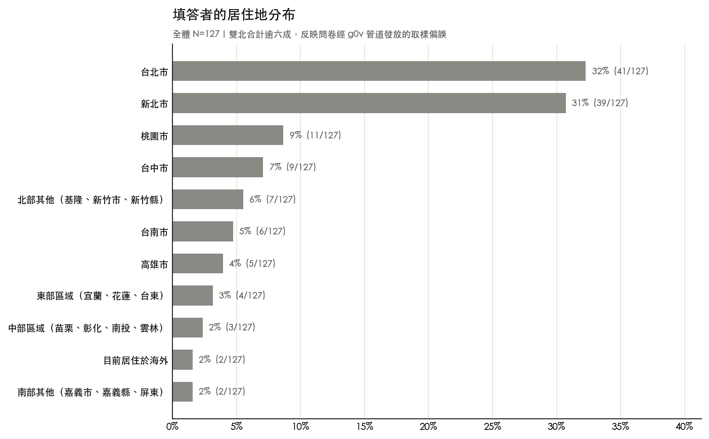

**公民科技不等於 g0v。** 全體填答者裡有 48%（61/126）從來沒參加過任何 g0v 活動；更關鍵的是，47 位真的做過專案的人裡，也有 28%（13/47）從未參加過 g0v 活動。而在「你從哪裡得知公民科技相關資訊」這題，「非營利組織」佔 59%（75/127），甚至比「開源社群（含 g0v）」的 54%（68/127）還高。這說明 g0v 是這個生態系裡很重要的節點，但不是唯一入口。如果只用「參加過幾次 g0v 活動」來判斷一個人有多投入公民科技，會漏掉不少實際做過專案、卻沒怎麼接觸 g0v 的人。

## 2　多數人只擔任一種角色，只有 10 個人身兼五種

### 他們在做什麼專案、擔任什麼角色

問卷請每個人回想自己在公民科技專案裡擔任過哪些角色，這題可以複選，因為同一個人常常身兼多職，例如可以同時是發起專案的人，也是實際動手把東西做出來的人。在 101 位至少接觸過公民科技的人裡，各角色的勾選比例是：使用過某個工具或參與過討論的人 89%（90/101）最多，接著是協助落地應用或推廣的人 48%（48/101）、參與籌備開發設計或維護的人 33%（33/101）、發起專案的人 28%（28/101）、出錢或調度資源的人 17%（17/101）。

這個由多到少的排序容易被誤讀成「一層一層往上爬」，但它不是漏斗，只是五種角色各自的普及率。因為角色是複選，勾了比較深的角色不代表也勾了比較淺的，例如勾「發起專案的人」的人裡，只有 82% 也勾了「使用過某個工具」。

**真正值得注意的是身兼多職的程度。** 只勾一種角色的人有 46 人，佔 46%；勾滿全部五種角色的只有 10 人，佔 10%。也就是說，**這個圈子裡有一大群人只固定做一件事，也有一小群人幾乎什麼都做**，中間的分布並不平均。而且參與越深的人，同時扮演的角色種類通常也越多，這兩件事其實是同一個現象的兩面。

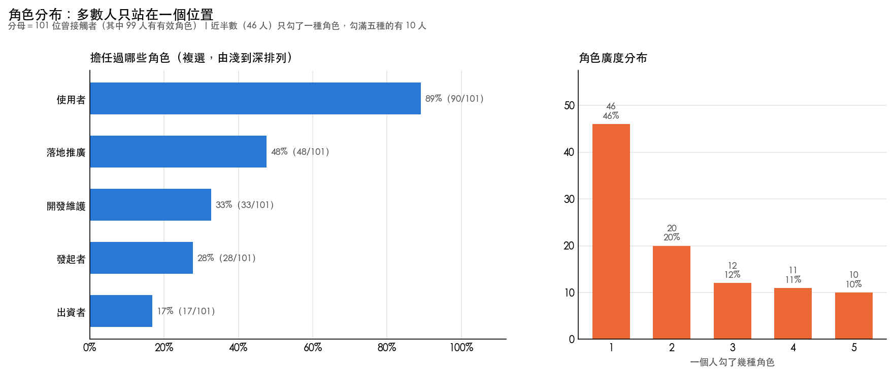

除了角色，問卷還問了每個人「哪一句最貼近你在公民科技圈子做的事」，這題只能選一個，由淺到深分成五個位置：接收資訊、主動通報、協力參與、共創解法、發起專案（另有 6 人選「以上都不太像我」，不算在這條軸上）。在 101 人裡，**最淺的「接收資訊」就佔了四成**（41%，41/101），其餘四個位置各在一成到兩成之間：主動通報 13%（13/101）、協力參與 11%（11/101）、共創解法 20%（20/101）、發起專案 10%（10/101）。要注意這不是逐級遞減的階梯，共創解法那一級（20 人）比它前面的協力參與（11 人）還多。

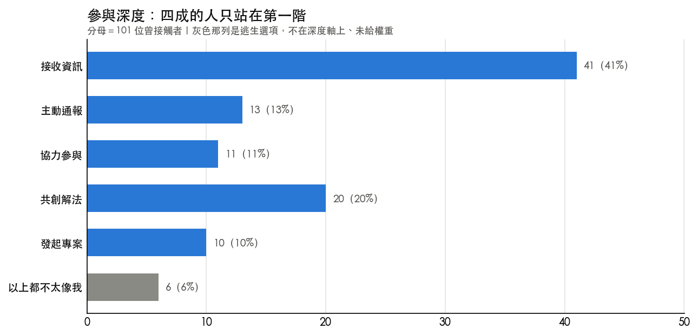

**做過專案的 47 人，填答當下專案走到哪個階段也不一樣。** 落地（東西已經做出來，正在設法讓它真的被用到）佔 36%（17/47）最多，接著是維運（持續運作、長期經營）28%（13/47）、早期（還在探索問題或開發中）23%（11/47）、已停擺 13%（6/47）。近三分之二的人手上的專案，已經走過最初的開發階段，正在面對「怎麼落地」與「怎麼維運」這兩關。

47 位曾參與者也各自用一句話描述了「最近參與的專案是為了解決什麼問題」。人工歸類後，最多人的主題是環境與生態，有 7 人（15%），接著是教育與學習、社群經營與協作工具、防災與公共安全，各有 5 人（11%），政治監督與開放國會、土地都市與地方、公共討論與民意工具，各有 4 人（9%）。另外，有 15 人的專案需要跟公部門打交道（政治監督與開放國會 4 人、土地都市與地方 4 人、防災與公共安全 5 人、公私協力與公務員 2 人），這和後面第 8 章談到的「公私協力怎麼談」需求最高互相對得上。

**這裡有一個之後會反覆出現的提醒：受訪者最想看的內容，和他們實際在做的專案主題，是兩件不同的事。** 例如「政府預算、決算與標案」是被問到「最想看哪個領域的資料清單」時排名最前面的（見第 8 章），但實際專案裡屬於這一類的只有 4 人。反過來，環境與生態實際做的人最多，在「最想看」的清單上卻排得比較後面。規劃內容時，這兩份清單不能互相替代，一個是閱讀需求，一個是社群實際的重心所在。

**這份問卷用兩種鏡頭看同一群人。** 一種是整體經驗，問的是「在你參與的經驗裡，你做過哪些角色」「哪一句最貼近你實際在做的事」「第一次投入時最打動你的是什麼」，這些問題不綁定任何特定專案，回答的是一個人在這個生態系裡累積下來的樣子，也就是本章談的內容。另一種是最近一次的那個專案：問卷中段請每位填答者想著最近參與的那一個專案回答，接著問那個專案在做什麼、走到哪個階段、用過哪些資源、遇到哪些困難，這是接下來第 3 到 5 章要談的內容。兩種鏡頭各自成立，但不宜直接相乘，一個人在圈子裡通常是發起者，不代表他最近參與的那個專案裡他也是發起者。

## 3　拖垮專案的是進度停滯與核心成員累垮，不是找不到夥伴

### 什麼卡住了專案

這一章的資料只有 47 位做過專案的人回答。問卷列出 13 種在公民科技專案裡常見的困難，請他們逐項評分。

**先說清楚這題問的是什麼**：評的是「這件事對你造成多大的困擾」，不是「這件事有沒有發生」。1 分是幾乎沒影響，3 分是明顯卡住你、拖慢進度，5 分是嚴重到做不下去或想退出。之所以量「對你的影響」而不是「專案有沒有停擺」，是因為填答的人裡有發起專案的人，也有幫忙的夥伴，如果把最高分定義成「導致專案停擺」，只有領頭的人對得上，夥伴會不知道怎麼選。

下面用兩個指標：**3 分以上**（3、4、5 分的人合計）表示這個困難真的卡住了進度；**4 分以上**（4、5 分合計）表示嚴重到讓人想退出。

**這題有一個限制要先講**：實際上線的問卷版本沒有「沒遇到」這個選項，13 題都必須從 1 到 5 選一個。所以「1 分」同時包含了「沒發生過」和「發生了但不影響我」兩種人。這也是本報告不用平均分來比較嚴重程度的原因，平均分會被系統性壓低。

| 排名 | 困難 | 3 分以上 | 4 分以上 |
|---|---|---|---|
| 1 | 專案難有穩定進度，容易停滯 | 38%（18/47） | 13%（6/47） |
| 2 | 做出來的成果很難真正發揮影響力 | 36%（17/47） | 13%（6/47） |
| 3 | 核心成員累垮，常常一個人撐住整個專案 | 32%（15/47） | 13%（6/47） |
| 4 | 找不到願意一起做的夥伴 | 23%（11/47） | 9%（4/47） |
| 5 | 公務員不信任你、不願給你需要的資訊 | 19%（9/47） | 9%（4/47） |
| 6 | 專案要改變方向或對外代表時，不確定誰有權責拍板 | 17%（8/47） | 0%（0/47） |
| 7 | 參與者突然消失，留下大量未完成任務 | 15%（7/47） | 2%（1/47） |
| 7 | 找不到對接的政府窗口、發訊息沒人理 | 15%（7/47） | 4%（2/47） |
| 9 | 抓不準專案到底要解決什麼問題 | 13%（6/47） | 4%（2/47） |
| 9 | 專案缺少文件或交接，人一走知識就斷了 | 13%（6/47） | 4%（2/47） |
| 9 | 想要的資料拿不到、不知道去哪要 | 13%（6/47） | 9%（4/47） |
| 12 | 新手或不會寫程式的人，不知道能幫什麼 | 11%（5/47） | 4%（2/47） |
| 13 | 拿到經費後不知道怎麼管帳、報稅或處理聘僱 | 6%（3/47） | 0%（0/47） |

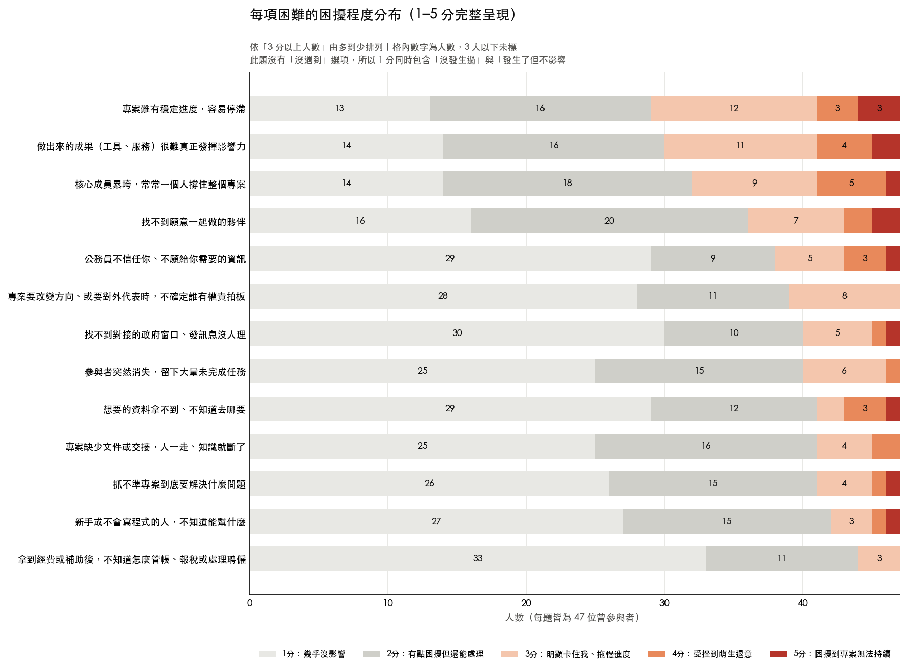

**前三名是進度停不住、成果沒有著力點、少數人硬撐，而一般最容易想到的「找不到願意一起做的夥伴」排在第四。** 這三件事會互相加乘：節奏斷掉讓成果遲遲出不來，成果出不來就更難證明值得投入，於是更少人願意接手，最後又回到少數人身上。

值得注意的是，前三名的「4 分以上」都是 13%（6/47），也就是各有 6 個人被困到萌生退意的程度。這些人不一定是同一批，但可以看出這三種困難不只是麻煩，而是真的會把人逼到想放棄。

### 3.1　「進度停不住」是所有位置的人都會遇到的

把 47 人依照他們在圈子裡的位置分成五組，再看「專案難有穩定進度」這一題，會發現各組的比例相當接近：接收資訊 40%（2/5）、主動通報 33%（2/6）、協力參與 25%（2/8）、共創解法 44%（8/18）、發起專案 40%（4/10）。

**沒有哪一組特別高或特別低。** 這是這份資料裡少見的、不分位置的困難。其他困難多半集中在特定的人身上，但進度停滯是整個生態系共通的問題，不是某一種角色的處境。

### 3.2　決定權越大的人，越容易被累垮

其他兩個排在前面的困難就不是這樣了。問卷請每個人選一句最貼近自己在公民科技圈子做的事，其中三種答案剛好排成一條線，差別在於**你對「這個專案要做什麼」有多少決定權**：

| 你在專案裡的位置 | 決定權 | 核心成員累垮 | 成果難發揮影響力 |
|---|---|---|---|
| 加入別人發起的專案，大方向由發起的人決定 | 最小 | 8 人中有 1 人（12%） | 8 人中有 1 人（12%） |
| 和大家一起把問題定義清楚、一起設計解法 | 一半一半 | 18 人中有 6 人（33%） | 18 人中有 8 人（44%） |
| 自己起頭，發現問題、找人、把事情啟動 | 最大 | 10 人中有 6 人（60%） | 10 人中有 5 人（50%） |

**兩個困難都隨著決定權變大而升高。** 自己起頭的那 10 個人裡，有 6 個說核心成員累垮明顯卡住了進度，是加入別人專案那組的五倍。

這條線只在上面這三種位置成立。另外兩種更淺的位置（只接收資訊 5 人、主動通報 6 人）人數太少，數字上下跳動，例如只接收資訊的 5 個人裡有 2 個說核心成員累垮，比例看起來有 40%，比中間兩組都高，明顯接不成一條線。所以這裡只講會實際動手做專案的三種位置，不把整條五級的線畫成一路上升。

**這個發現也可能有別的解釋。** 決定權大的人本來就承擔比較多事情，被累垮的比例高不一定是因為位置本身讓人累，也可能是因為會走到那個位置的人，原本就是願意扛比較多的那種人。這份問卷是同一個時間點的橫斷面調查，沒有辦法分辨這兩種情況。

### 3.3　站在決策位置的人，看不見新手的困境

反過來看「新手或不會寫程式的人，不知道能幫什麼」這一題，型態完全相反：主動通報 33%（2/6）、只接收資訊 20%（1/5）、加入別人專案 12%（1/8）、共創解法 0%（0/18）、發起專案 10%（1/10）。

**比較淺的位置感受得到，共創解法那 18 個人裡則是一個都沒有。** 這代表如果要規劃「怎麼讓新手參與」的內容，光去問發起專案的人可能問不出來，因為那不是他們會遇到的困難。不過這幾組的人數都在 5 到 18 人之間，格子很小，這個對比只能當作值得再確認的方向。

### 3.4　一個看起來成立、但這份資料分不開的方向

還有一種切法，是依「一個人做過哪些角色」來看誰的負擔比較重。乍看之下有規律：把 13 種困難裡達到 3 分以上的題數加起來當作負擔的粗略指標，五個角色群的中位數是使用者 1 題、落地推廣角色 2 題、開發維護角色 2 題、發起者 2 題、出資者 3 題，看起來越往後負擔越重。

**但這條線在這份資料裡分不開。** 有三個理由：

第一，角色是複選題，一個人可以同時屬於好幾個角色群，這五組不是互斥的，本來就不適合互相比高低。

第二，**負擔比較重的那幾組，平均身兼的角色種類也比較多**（從 3.5 種到 4.6 種）。所以到底是「這個角色本身比較辛苦」，還是「身兼多職的人本來就會撞上比較多種困難」，這份資料分不出來。

第三，如果直接用「一個人勾了幾種角色」來排，這條線本身也不是一路上升的：勾 3 種角色的人中位數是 2.5 題，勾 4 種的反而降到 2 題，勾 5 種的才回到 3 題。統計上，角色種類與困擾題數之間的關聯很弱（相關係數 0.23，落在「缺乏關聯」的範圍），而且逐級也不單調。

所以本報告不把「角色越深越辛苦」當成一項發現。**這個方向值得再驗證，但需要能把「角色」和「身兼多職」拆開的設計，這份問卷做不到。** 相對地，第 3.2 節用的參與深度是單選題、各級互斥、而且本身就有明確的順序（對專案方向的決定權多寡），才是這份資料裡能讀成階梯的軸。

### 3.5　他們實際做了什麼

問卷另外問了「面對這些困難，你有採取什麼行動去解決嗎」，這題是選填，28 人回答。人工歸類後：

| 採取的行動 | 人數 |
|---|---|
| 向外求助：找人脈、專家或在地組織 | 6 |
| 降低期待、放慢步調 | 5 |
| 自己補能力或用工具頂著 | 4 |
| 團隊內部溝通、建立固定節奏 | 4 |
| 對外推廣、擴大能見度 | 4 |
| 沒有特別行動或尚未行動 | 3 |
| 只描述困難，沒有提到行動 | 3 |
| 建立文件、避免交接斷層 | 1 |
| 交棒或淡出 | 1 |

**最常見的兩種應對，方向完全相反。** 一種是向外求助（6 人），另一種是降低期待、放慢步調（5 人），後者的用詞相當一致，像是「佛系經營」「慢慢做即可」「只能靠慢慢累積」。再加上「沒有特別行動」和「只描述困難沒提行動」的 6 人，28 位填答者裡有 11 人屬於沒有主動處理或主動降低期待。

這對規劃內容有直接的意義：社群自己摸索出來的解法，集中在「找對的人」和「建立節奏」這兩件事上。而「佛系」多半不是一種策略，是撐不下去時的合理反應。如果方法論的內容能把「向外求助」的具體做法寫清楚，例如該找誰、怎麼開口、拿什麼交換，正好補上這 11 人的缺口。

這一題只有 28 人填答，而且願意寫下自己怎麼應對的人，本來就可能是比較願意分享、也比較主動的那一群，所以這個分布不能代表全部 47 人。

## 4　四成的人動機換過一輪，流失最多的是社群歸屬感

### 什麼讓人繼續做下去

問卷分別問了 47 位曾參與者「第一次投入時最打動你的是什麼」與「現在還讓你留下來的是什麼」，兩題都可以選最多兩項。把兩次的答案放在一起比對：

| 動機 | 第一次選的人數 | 現在選的人數 | 兩次都選的人 | 不再選的人 | 後來才選的人 |
|---|---|---|---|---|---|
| 認同這件事想達成的目標 | 39 | 39 | 36 | 3 | 3 |
| 認同這個社群，想成為一員 | 20 | 17 | 14 | 6 | 3 |
| 純粹覺得好玩、有趣 | 16 | 15 | 13 | 3 | 2 |
| 想認識新朋友、找到同好 | 13 | 15 | 12 | 1 | 3 |
| 身邊有人在做，跟著加入 | 12 | 12 | 8 | 4 | 4 |
| 累積作品集、練功或建立好名聲 | 6 | 9 | 5 | 1 | 4 |

單看第一次與現在的總人數，會誤以為大家的動機幾乎沒變，例如「認同目標」都是 39 人。但逐人比對後發現，**47 人裡有 19 人（40%）動機的組合其實換過**，只是換進換出剛好讓總數看起來很穩定。

三個值得注意的變化：**「認同這個社群、想成為一員」是流失最多的動機**，20 人裡有 6 人後來不再選它；**「身邊有人在做，跟著加入」的人裡，有 4 人後來換了理由**，人際帶進來的人似乎最需要在中途找到自己的理由；**「累積作品集、練功」是唯一淨增加的動機**，從 6 人變成 9 人，這是比較務實的長期誘因，不是社群常自我期許的那種熱情。

這裡有一件事要說清楚：**上面說的「留存」，指的是同一個人前後兩次都選了同一個動機，不是指這個人有沒有留在社群裡。** 這 47 位填答者現在都還在圈子裡，已經完全離開的人不會來填這份問卷，所以我們沒有辦法知道「哪一種動機真的留住了誰」。可以講的是：留下來的人裡，最一致的理由是認同目標（39 人到 39 人）；社群歸屬感是最容易褪色的一個（20 人到 17 人，留存率 70%，是所有動機裡最低的之一）。

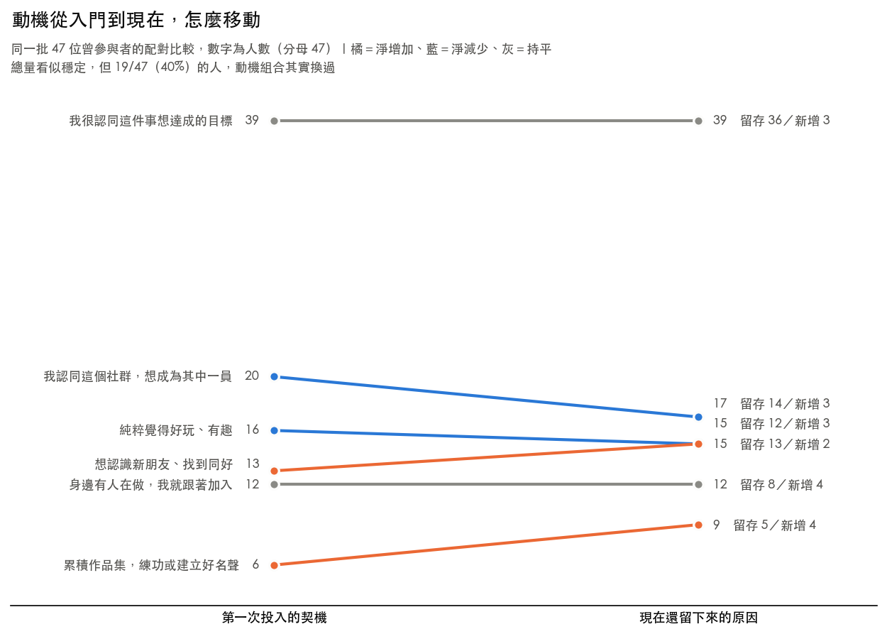

把曾參與者依年齡分成三群（30 歲以下 10 人、31 到 40 歲 19 人、41 歲以上 18 人）再看一次現在的動機，會看到一些差異：30 歲以下選「累積作品集、練功」的比例是 40%（4/10），比全體的 19%（9/47）高出不少；41 歲以上幾乎只剩「認同目標」一個理由（89%，16/18），選「好玩」的只有 2 人、選「社群」的只有 3 人，都明顯低於全體。不過這三個年齡層各自只有 10 到 19 人，樣本偏少，這個世代差異只能當作值得再驗證的方向，不足以直接下決策。而且這是同一個時間點的橫斷面資料，不是真正追蹤同一群人隨時間改變，不能說是「某個年齡層的人被什麼留住了」，只能說「不同年齡層現在選的理由不一樣」。

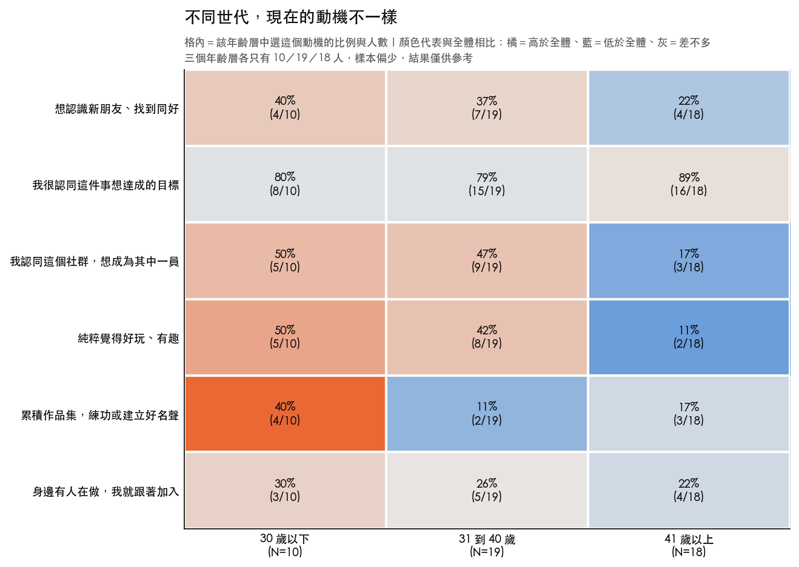

## 5　人脈是最常用的資源；做到落地那一段，最多人說只能靠自己

### 他們手上有什麼、缺什麼

問卷問了 47 位曾參與者「這個專案從開始到現在，曾使用過哪些資源」，可以複選。

用過人脈的有 66%（31/47），是所有資源裡最高的，比經費 47%（22/47）還多。接下來依序是公開資料或開放資料 45%（21/47）、場地 40%（19/47）、現成的數位工具或平台 36%（17/47）、政府窗口 34%（16/47）。另外有 23%（11/47）表示「主要靠我自己想辦法」。

**在這次調查裡，人脈比錢更常被用到。** 這和一般想像的「公民科技最缺的是經費」不太一樣。不過要注意，這題問的是「用過哪些」，不是「哪些最難拿到」，用得多也可能只是因為人脈相對容易取得，不代表它不重要或不稀缺。

### 5.1　做到落地那一段，最多人說只能靠自己

更值得注意的是這些資源怎麼隨專案階段分布。依每個人最近參與的專案目前所在的階段分成四組，回答「主要靠我自己想辦法」的比例是：早期（還在探索問題或開發中）27%（3/11）、**處於「落地」階段（東西已經做出來，正在設法讓它真的被目標對象用到）35%（6/17）**、維運 15%（2/13）、已停擺 0%（0/6）。落地那一組最高。

同一組人用過人脈的比例 47%（8/17）與用過經費的比例 29%（5/17），也都是四組裡最低的。相對地，維運那一組用過人脈的比例是 85%（11/13）、經費 62%（8/13），兩項都是四組裡最高。

**也就是說，當一個人手上的專案走到「東西已經做出來、正在設法讓它真的被用到」這一段時，他能調度到的外部支持是最稀薄的。**

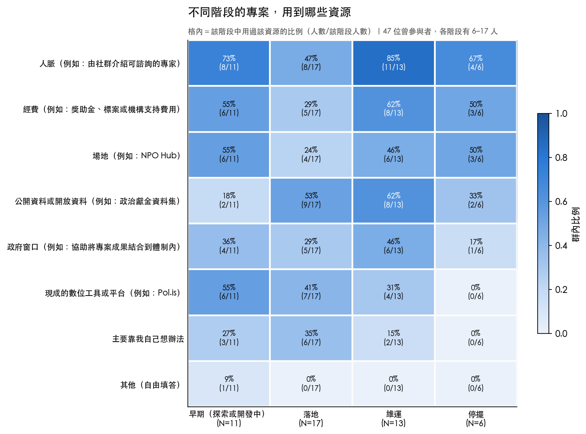

這個型態要打三個折扣。第一，這是**不同人之間**的比較，不是同一個人或同一個專案隨時間的變化，不能讀成「做到落地之後支持就變少」。第二，這題問的是整個專案歷程用過什麼，落地期的人可能只是還沒用到那些資源，不是要不到。第三，維運那一組的高比例可能是倖存者偏誤：能撐到維運的專案，本來就比較可能是有辦法取得資源的那些，中途因為要不到資源而停掉的專案，多半不會出現在這份資料裡（已停擺那一組只有 6 人，看不出真正的樣貌）。

### 5.2　一個值得驗證、但這份資料還說不準的方向

如果改用「一個人在圈子裡通常做什麼」來分組，看起來會是另一個故事：回答「主要靠我自己想辦法」的比例，接收資訊 0%（0/5）、主動通報 17%（1/6）、協力參與 38%（3/8）、共創解法 11%（2/18）、發起專案 50%（5/10）。發起專案的那一組最高，看起來像是「發起者最孤立」。

**但這條線接不起來**：協力參與的 38% 比共創解法的 11% 還高，中間是斷的，不是一路上升。而且如同第 2 章末尾說的，「你在圈子裡通常做什麼」問的是一個人的整體經驗，「這個專案用過哪些資源」問的是最近那一個專案，兩者中間隔了一層，一個人平常是發起者，不代表他最近參與的那個專案裡他也是發起者。

所以本報告談資源時，以專案階段為主，不用這一組數字下結論。「發起專案的人是不是特別孤立」值得再確認，但要問清楚需要直接針對同一個專案問「在這個專案裡你是什麼位置」，這份問卷沒有這樣問。

## 6　出資者認為早期最難找資源，提案端最孤立的卻是落地階段

### 出資端怎麼評估一個專案

問卷裡有 27 人表示曾經為公民科技專案提供過經費方面的支持，這一章是他們的回答。27 人是很小的樣本，以下所有數字都只能當作方向參考。

**先看他們怎麼評估一個專案值不值得支持**（最多選 3 個）：

| 評估時最看重的 | 人數 |
|---|---|
| 它要解決的問題夠重要、而且講得夠清楚 | 59%（16/27） |
| 呼應我自己關心的議題 | 52%（14/27） |
| 團隊或發起人的能力和信譽 | 44%（12/27） |
| 預期能產生看得到、而且能被衡量的影響 | 44%（12/27） |
| 專案有長期維持下去的規劃，不會經費花完就停止 | 41%（11/27） |
| 當時剛好有預算或資源 | 26%（7/27） |

排在最前面的兩項都跟「這件事本身值不值得做」有關，而不是團隊有多強或成果有多漂亮。**「問題講得夠清楚」排第一，某種程度上是一個可以行動的訊號**：把問題說明白，比先把成果做漂亮更早被看見。

### 6.1　兩邊看到的資源缺口，不在同一段

接著問他們「以你的觀察，最難找到資源的，是處在哪個階段的專案」。27 人的答案是：還在很早期、只有想法的 52%（14/27）、已經上線要長期維運的 37%（10/27）、已經做出原型要往落地走的 11%（3/27）。（這題在問卷設計上標為複選，但實際作答裡每個人都只選了一個階段。）

**出資者認為落地那一段最不缺資源，只有 11% 的人選它。** 但第 5 章看到的正好相反：最近參與的專案處在落地階段的 17 人裡，有 6 人（35%）說主要靠自己想辦法，是四組裡最高的。

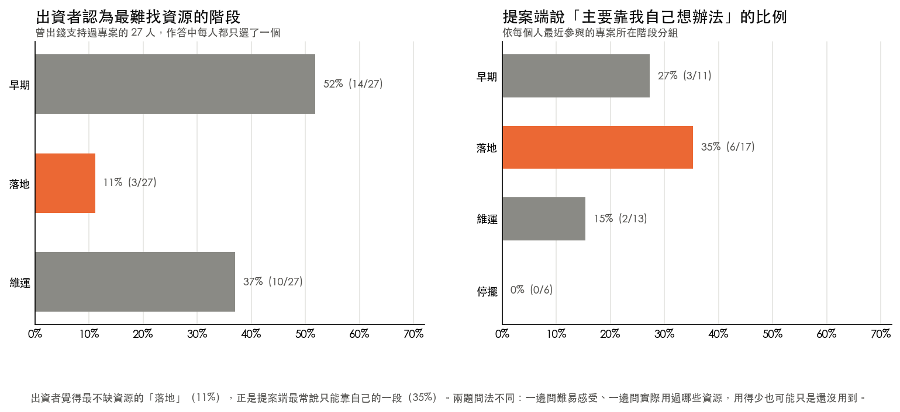

**出資者覺得最不缺資源的那一段，正是提案端最常獨自撐著的那一段。**

這個對照要打三個折扣。第一，兩邊回答的不是同一個問題：出資者答的是「哪個階段最難找資源」，是一種難易感受；提案端答的是「這個專案從頭到尾用過哪些資源」，是實際使用狀況。用得多不代表容易拿，也可能是難拿所以到處張羅；用得少也可能是還沒用到，不是要不到。第二，兩題的階段選項不是同一套：問出資者時只給了早期、落地、維運三個選項，問提案端時另外還有「已停擺」，兩邊的「落地」是本報告判讀為同一段，不是問卷寫死的對應。第三，兩邊人數都不多，出資者 27 人、落地那一組 17 人。

即使打完這三個折扣，這個落差仍然值得放在檯面上討論。**如果出資端的注意力集中在「早期只有想法」的專案，而實際上最孤立的是已經做出東西、正在想辦法讓它被用到的那一段，那麼資源投入的時機可能和需求的時機錯開了。** 要確認這件事，需要更大的樣本，以及直接問提案端「你在哪個階段最難找到資源」，讓兩邊回答同一個問題。

## 7　新人卡在不知道有哪些專案、身邊沒有人帶，技術門檻只排第四

### 這個圈子的入口在哪、斷在哪

這一章要問兩個問題：消息是怎麼傳到人身上的，以及還沒接觸過的人為什麼還沒踏進來。

問卷問了全體 127 人「你現在主要透過哪些管道，得知 g0v 的活動消息」，可以複選。單一選項裡排最前面的兩個是 g0v 的社群帳號（Facebook、Threads、Instagram）與親友推薦，都是 40%（51/127）；接著是 g0v 的 Slack 23%（29/127）、揪松團每月電子報 19%（24/127）、揪松團 LINE 群組 12%（15/127）。另外有 11%（14/127）表示「都沒有，我之前不太清楚這些管道」。

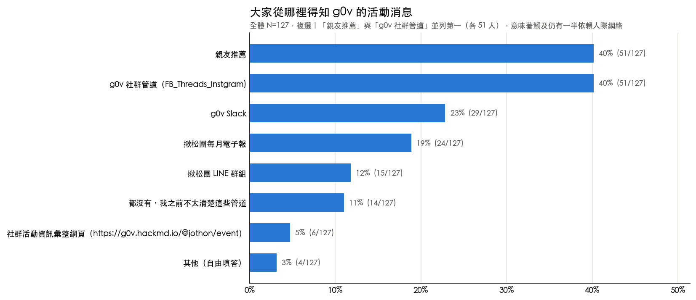

不過**把單一個官方帳號拿來跟親友推薦比，會高估人際管道的份量**。上面列的管道裡，社群帳號、Slack、電子報、LINE 群組、活動彙整網頁都是官方經營的。把這五個合起來去重計算（同一個人勾了好幾個只算一次），會看到不一樣的圖像：

| | 至少用到一個官方管道 | 有靠親友推薦 |
|---|---|---|
| 全體 127 人 | 65%（83/127） | 40%（51/127） |
| 做過專案的 47 人 | 72%（34/47） | 47%（22/47） |

**官方管道觸及到的人明顯比親友推薦多。** 這和「這個圈子主要靠人際網絡傳播」的印象不太一樣。

但這兩欄會互相重疊（一個人可以同時勾官方管道和親友推薦），所以真正要問的是：**有多少人是只靠親友推薦、沒有接上任何官方管道的？** 把 127 人拆成互斥的四組：

| 這個人怎麼收到消息 | 全體 127 人 | 做過專案的 47 人 |
|---|---|---|
| 只有官方管道 | 48%（61/127） | 51%（24/47） |
| 官方與親友都有 | 17%（22/127） | 21%（10/47） |
| **只靠親友推薦，沒有任何官方管道** | **23%（29/127）** | **26%（12/47）** |
| 兩者都沒有 | 12%（15/127） | 2%（1/47） |

**大約每四個人就有一個，是只透過認識的人收到消息的。** 這群人如果只看官方管道的觸及數字，會完全看不見。對經營者來說，這是官方管道再怎麼加強也接不到的一群，只能靠既有參與者往外帶。

另外值得注意的是最後一列：**在做過專案的 47 人裡，「兩者都沒有」只剩 1 人**（2%），但在全體裡有 15 人（12%）。已經動手做過專案的人，幾乎都有接上某條線。

兩個提醒。第一，這題問的是「你現在主要透過哪些管道得知活動消息」，不是「你當初怎麼入坑的」，兩者不能混為一談。第二，**這份問卷本身就是透過這些管道發放出去的**，填得到這份問卷的人，本來就比較可能是這些管道觸及得到的人，所以「兩者都沒有」那一組在真實世界裡只會更多，不會更少。

再看還沒接觸過公民科技的 26 人，這題問的是「你還沒有加入的原因是什麼」，26 人全數作答。排前面的三個原因是：不知道有哪些專案或議題可以參與 62%（16/26）、身邊沒有人帶、怕融不進去或幫不上忙 54%（14/26）、不知道怎麼加入、找不到入口 50%（13/26）。**「覺得要會寫程式，技術門檻太高」只排到第四，35%（9/26）**，比前三個原因都低。

**排前面的三個原因都跟「資訊」與「有沒有人帶」有關，不是「能力夠不夠」的問題。**

把這一題和前面的管道資料放在一起看，會得到一個比較完整的說法：官方管道其實觸及得不差，六成五的填答者至少接上一條；但**光是「收得到消息」不等於「知道可以做什麼、有人可以問」**。還沒踏進來的人卡住的地方，是不知道有哪些專案、身邊沒有人帶、找不到入口，這三件事都不是多發一則貼文就能解決的。而另外有大約四分之一的人根本不在官方管道的射程內，只透過認識的人收到消息。

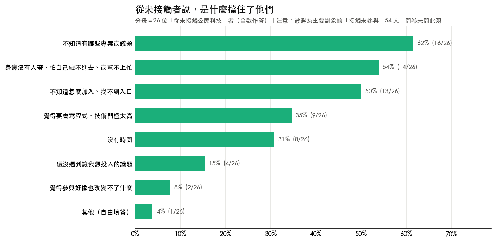

問卷也問了大家想參加什麼樣的活動（全體 127 人，最多選 2 個），排前面的是「公私協力怎麼談」57%（73/127）、「公民科技實戰心法」51%（65/127）、「資料庫入門」49%（62/127）、「用 AI 幫你提案」33%（42/127）。把三種人分開看，喜好會反過來：「資料庫入門」在還沒接觸的人裡最受歡迎（69%，18/26），在做過專案的人裡排得比較後面（36%，17/47）；「公私協力怎麼談」正好相反，在做過專案的人裡最高（62%，29/47），在還沒接觸的人裡比較低（46%，12/26）。這暗示入門型的活動比較適合服務還沒接觸過的人，深度型的活動比較適合服務已經投入的人，辦活動時分開辦可能比混在一起辦更有效，不過「還沒接觸」這一層只有 26 人，這個型態還需要更多樣本驗證。

## 8　兩件事最值得先做：讓人找得到專案，以及把「成果如何落地」寫清楚

### 所以，該提供什麼內容

前面七章講的是現況，這一章把它們接到「該投入什麼」上。

### 8.1　怎麼決定哪些內容值得先做

問卷用了一種成對的問法來測需求：對每一個主題，先問「如果有這樣一篇文章，你的感覺如何」，再問「如果沒有，你的感覺如何」。把兩題的答案交叉後，可以把主題分成四種：

- **魅力型**：有了會驚喜，沒有也不會抱怨。屬於加分項。
- **期望型**：有了滿意度線性上升，沒有會明顯失望。投資報酬最穩定。
- **基本型**：有了覺得理所當然，沒有會不滿。屬於門檻，不做像是缺漏。
- **無差別**：有沒有都無感。優先度最低。

這樣分的用意，是避免只用「多少人說想看」來排序。想看的人多，不代表沒有就會被抱怨；反過來，有些主題勾選率不高，卻是沒有就說不過去的基本盤。

**五個候選的方法論主題，全部落在「魅力型」，沒有任何一個是「基本型」。**

| 主題 | 落點 |
|---|---|
| 怎麼讓做好的東西真正落地、接進體制 | 魅力型（最接近期望型） |
| 怎麼留住夥伴、維持團隊運作的能量 | 魅力型 |
| 沒有現成資料時，怎麼搜尋、整理或自建資料集 | 魅力型 |
| 怎麼捲動更多人（包含不會寫程式的人）一起參與 | 魅力型 |
| 如何發起一個公民科技專案 | 魅力型 |

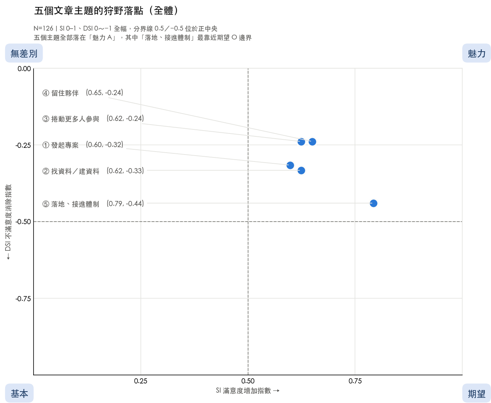

**全部落在魅力型這件事本身就是一個結論**：這些內容寫了都會讓社群覺得有價值，但目前都還不到「不寫會被抱怨」的程度。這符合這個圈子長期靠黑客松與口耳相傳累積知識的現況，也代表內容規劃有相當大的空間，不必急著補某個缺口，而是選最能加分的先做。

其中「**怎麼讓做好的東西真正落地、接進體制**」明顯最強，它的無差別票數最少，也最接近期望型的邊界，是五個主題裡爭議最小的首選。這一點和第 3 章、第 5 章的發現對得起來：成果難發揮影響力是第二大困難，而落地階段又是資源最稀薄的一段。**三份不同的資料指向同一個地方。**

把三群人分開看，還有一個值得注意的差異：「怎麼捲動更多人參與」和「怎麼留住夥伴」這兩個主題，對還沒接觸過公民科技的人來說落在「無差別」，但對另外兩群人都是「魅力型」。**沒進場的人感受不到團隊經營的痛。** 不過還沒接觸的那一群只有 26 人，這個差異值得用更大的樣本驗證，不足以單獨當作決策依據。

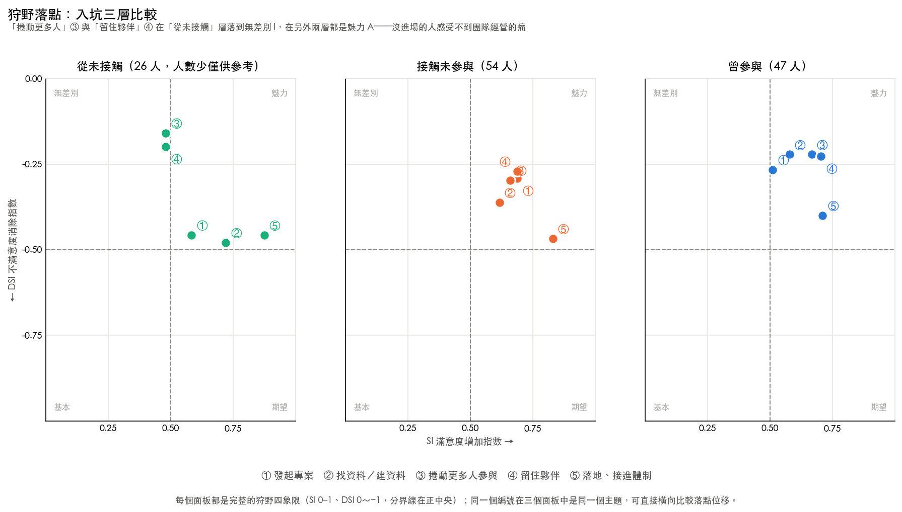

### 8.2　大家想看哪些領域與工具

除了方法論，問卷也問了想看哪些議題領域的資料清單（最多選 5 個）與哪些跨領域工具的介紹（最多選 3 個）。

**跨領域工具**：群眾協力與通報工具 61%（77/126）、AI 應用 54%（68/126）、資料視覺化工具 52%（65/126）、地理資訊與地圖工具 42%（53/126）、民意蒐集與線上審議工具 33%（41/126）、怎麼找到現成的研究成果 31%（39/126）、開放協作知識庫 19%（24/126）。

**議題領域**：政府預算決算與標案 54%（68/127）、地方發展與地方創生 47%（60/127）、防災與災害應變 43%（54/127）、假訊息與詐騙防治 42%（53/127）、環境汙染與公害 31%（39/127）、法律與立法歷程 31%（39/127）。

這裡有一個容易被忽略的比較基準：**工具題最多只能選 3 個，領域題可以選 5 個，工具在更緊的上限下仍然拿到更高的勾選率**，所以工具類的真實需求只會被低估，不會被高估。

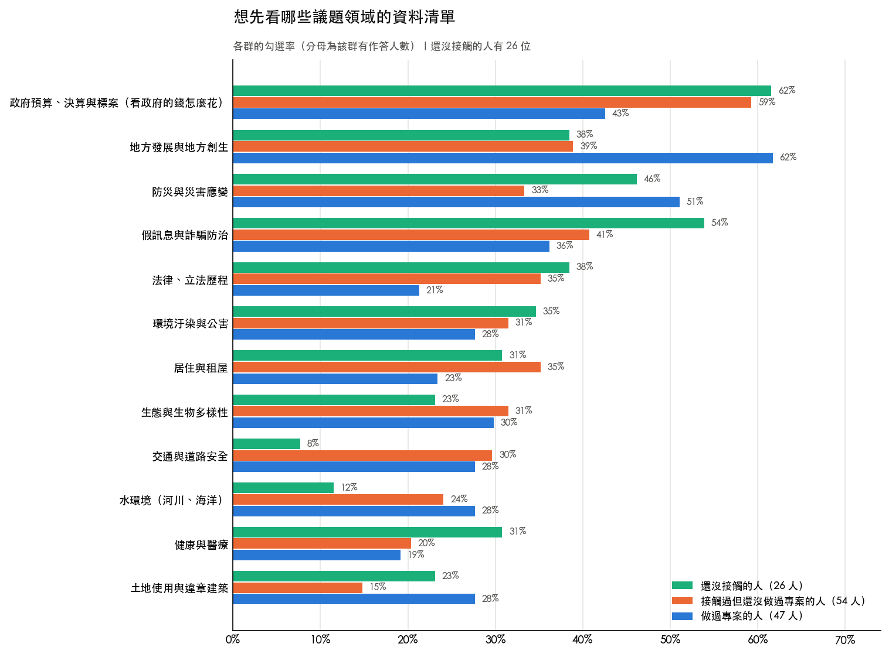

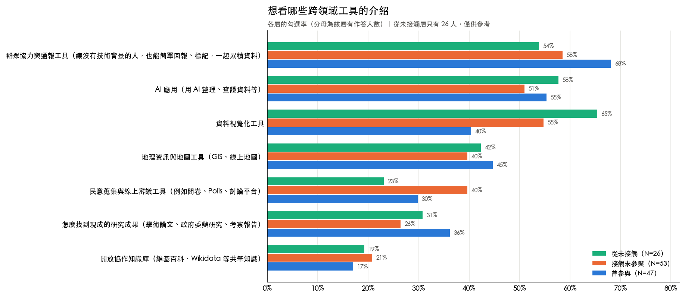

再提醒一次第 2 章提過的事：**這份「想看什麼」的清單，和大家實際在做什麼，是兩件不同的事。** 政府預算排在想看清單的第一名，但實際專案屬於這一類的只有 4 人；環境與生態實際做的人最多（7 人），在想看清單上卻排得比較後面。規劃內容時兩者不能互相替代。

### 8.3　從診斷接到處方

把前面幾章的發現和這一章的需求排序放在一起，可以對出四組一對一的關係：

| 診斷：讀者卡在哪 | 處方 |
|---|---|
| 不知道有哪些專案或議題 62%（16/26） | 讓專案被看見、找得到的入口 |
| 不知道怎麼做（五個方法論主題全部落在魅力型） | 方法論長文 |
| 不知道去哪找資料與工具（群眾協力 61%、AI 應用 54%） | 資源短文 |
| 身邊沒有人帶 54%（14/26） | 活動 |

**兩件事最值得先做。**

第一是**讓人找得到專案**。第 7 章顯示，擋住新人的頭號原因是不知道有哪些專案或議題可以參與，而不是能力不夠。g0v 揪松團經營的[台灣公民科技資料庫](https://civictech.tw/)本來就在做這件事，收錄了可以參考的專案與行動指引。這條診斷和處方之間幾乎是直接對應的：既有的內容庫要能被還沒進門的人找到、看得懂、知道從哪裡接上。

第二是**把「成果如何落地」寫清楚**。這是五個方法論主題裡最強的一個，也是第 3 章第二大的困難、第 5 章資源最稀薄的階段。三份資料指向同一件事，代表這不是單一題目的雜訊。

需要說明的是，**這份調查測的是哪些主題最值得投入，不預設要新寫還是改寫既有內容**。上面那種成對的問法，測的是「有這篇和沒這篇」之間的感受落差，正好適合用來判斷一個主題值不值得投入心力。

### 8.4　如果你想支持這個生態系

如果你是可能提供資源的一方，這份調查有幾件事值得參考。

**注意落地那一段。** 第 6 章顯示，出資端普遍認為早期只有想法的專案最難找資源，但從做專案的人這邊看，最常說只能靠自己的反而是已經做出成果、正在設法讓它被用到的那一段。兩邊的判斷不一致，這個落差本身值得再確認。

**支持的形式不只有錢。** 第 5 章顯示，人脈是最常被用到的資源，比經費還多。介紹一位可以諮詢的專家、幫忙接上一個政府窗口、提供一個開會的場地，在這份資料裡都是實際被用到的支持形式。

**注意那些撐住專案的人。** 第 3 章顯示，決定權越大的人被累垮的比例越高，自己起頭的 10 個人裡有 6 個說核心成員累垮明顯卡住了進度。而第 4 章顯示，社群歸屬感是最容易褪色的動機。這兩件事加起來，代表長期支持一個專案時，除了看成果，也值得看看撐著它的那幾個人還撐不撐得住。

**問題講得夠清楚，比成果做得漂亮更早被看見。** 這是出資端自己說的：評估一個專案時最看重的是「它要解決的問題夠重要、而且講得夠清楚」59%（16/27），排在團隊信譽和可衡量的影響之前。

---

## 9　對立假設：每條結論的另一種解釋

前面每一章談到主要發現時，都在原地附上了另一種可能的解釋。這一章把它們集中列出來，方便查核，也方便判斷哪些結論可以放心引用、哪些只能當方向。

| 本報告的結論 | 另一種可能的解釋 |
|---|---|
| 決定權越大的人，被累垮的比例越高（第 3 章） | 也可能是**選擇效應**：會走到決定權大的位置的人，本來就是願意扛比較多的那種人。橫斷面資料無法分辨是位置讓人累，還是願意累的人才走到那個位置。 |
| 進度停滯不分位置，是生態系共通的問題（第 3 章） | 這一題的五組人數在 5 到 18 人之間，比例接近也可能只是小樣本下的巧合，不必然代表真的均勻。 |
| 站在決策位置的人看不見新手的困境（第 3 章） | 也可能是**題目理解差異**：決策位置的人可能把這題讀成「我自己知不知道能幫什麼」，而不是「新手知不知道」。 |
| 社群歸屬感是最容易褪色的動機（第 4 章） | 我們只問得到還留在圈子裡的人。如果社群歸屬感真的留不住人，那些人早就離開、不會來填這份問卷，這個流失比例反而可能被低估。 |
| 41 歲以上幾乎只靠「認同目標」留下（第 4 章） | 可能是**世代差異**，也可能是**留下來的人本身就被篩選過**：年紀較長還留在圈內的，本來就比較可能是使命導向的那些人。 |
| 落地階段的人最常說只能靠自己（第 5 章） | 可能是**題目定義**造成：這題問的是整個專案歷程用過哪些資源，落地期的人可能只是還沒用到，不是要不到。 |
| 維運階段資源使用率最高（第 5 章） | **倖存者偏誤**：能撐到維運的專案，本來就比較可能是有辦法取得資源的那些。因為要不到資源而中途停掉的專案，多半不會出現在這份資料裡。 |
| 親友推薦是最大的消息管道之一（第 7 章） | **問卷本身就是靠這些管道轉發擴散的**，會系統性高估人際管道。這個數字反映的是「填到這份問卷的人怎麼來的」，未必是「所有人怎麼來的」。 |
| 擋住新人的是資訊不是技術（第 7 章） | 這 26 人是**已經聽過或看過公民科技**的人，不是完全沒聽過的一般大眾。對後者來說，門檻可能落在完全不同的地方。 |
| 雙北佔六成（第 1 章） | 完全是**取樣結果**。問卷經 g0v 管道發放，g0v 的實體活動長期在台北舉辦，不能推論成社群真實的地理分布。 |
| 出資端與提案端的缺口不在同一段（第 6 章） | 兩邊回答的不是同一個問題（難易感受 vs 實際使用），階段選項也不是同一套。這個落差值得再確認，但還不能當成定論。 |

## 10　這份資料不能說什麼

以下這些推論**沒有資料支持**。寫文章、做簡報、對外引用這份報告時，都不應該出現。

1. **不能說任何因果關係。** 所有交叉分析都只是相關，例如不能說「因為缺少人脈，所以專案停擺」。
2. **不能說「台灣的公民科技參與者如何如何」。** 樣本經由 g0v 相關管道發放，只能說「本次受訪的 127 位填答者中」。
3. **不能說中南部沒有社群。** 雙北佔六成是取樣造成的，不是分布事實。
4. **不能說某個動機「留住」了誰。** 我們沒有追蹤已經離開的人，已經完全離開的人不會來填這份問卷。第 4 章講的「不再選這個動機」，指的是同一個人前後兩次的選擇不同，不是這個人離開了社群。
5. **不能說「接觸過但還沒做過專案」的 54 人為什麼還沒動手。** 問「為什麼還沒加入」那一題，問的對象是完全沒接觸過的 26 人。這 54 人的需求與偏好有資料，但沒有問過他們猶豫的原因。
6. **不能用困擾題的平均分比較嚴重程度。** 實際上線的問卷沒有「沒遇到」選項，1 分混合了「沒發生過」與「發生了但無感」兩種人，平均分會被系統性壓低。
7. **不能說「73 人想參加公私協力活動」。** 該題限制最多選 2 個，正確的說法是「在最多選 2 個的限制下，有 73 人把它列入」。
8. **不能對人數少於 30 的分組下決策。** 包括還沒接觸的人 26 位、曾出資者 27 位、各年齡層 10 到 19 位。
9. **不能說五個方法論主題之間的細微差異有意義。** 五個主題的矛盾答案比例都在 5.6% 到 7.1% 之間，指數的絕對值不宜精讀，只看相對排序與落在哪一種類型。
10. **不能把「一個人在圈子裡通常做什麼」拿去解釋「他最近那個專案發生了什麼」。** 角色、參與深度、動機問的是整體經驗，階段、資源、困擾錨定在最近參與的那一個專案，兩者中間隔了一層（見第 2 章末）。

## 11　限制與信賴度揭露

**取樣偏誤。** 問卷透過 g0v 及相關社群管道發放，樣本偏向已經對公民科技有興趣的人。這份調查撈不到三種人：對公民科技完全無感的一般大眾、政府端的視角、以及已經徹底離開這個圈子的人。曾出資者也只有 27 位。

**深度分支的天花板。** 所有跟專案有關的題目（階段、資源、投入時數、困擾、動機）都只有做過專案的 47 人回答，這是本報告最硬的限制。任何再往下細分，每一組都會掉到十幾人。報告中凡是這種情況都已標明「僅供參考」或「值得再驗證」。

**困擾題缺少「沒遇到」選項。** 見第 3 章開頭的說明。

**沒有問「接觸過但還沒做過專案」的人為什麼還沒動手。** 「為什麼還沒加入」那一題只問了完全沒接觸過的 26 人。若日後想了解站在圈子邊緣、還沒跨出那一步的人在猶豫什麼，用 5 到 8 人的深度訪談會比問卷更適合，這類猶豫通常講不清楚，需要對話才問得出來。

**「想看」不等於「在做」。** 議題領域題與跨領域工具題問的是閱讀偏好，不是填答者實際投入的專案領域。

**橫斷面資料。** 動機的「改變」是同一個時間點回想過去再自己陳述，不是真正追蹤同一群人隨時間變化，會有回憶偏誤。

**判斷數字能不能用的兩條規則。** 本報告用兩條規則：一組人少於 30 位時，該組的比例只當方向參考，不單獨作為決策依據；不做統計顯著性檢定，因為曾參與者只有 47 人，任何二維交叉的每一格都在個位數到十幾人之間，檢定的前提不成立，做了也無效。因此本報告只呈現比例與方向，並在樣本少的地方直接標明。

---

## 附錄 A　方法備忘

正文用不到，想查再看。

### A1　資料怎麼清理的

| 步驟 | 內容 | 影響 |
|---|---|---|
| 移除個資 | email、聯絡電話整欄刪除 | 98 筆 email、71 筆電話 |
| 人名去識別化 | 開放題中的社群成員姓名代換為 `[去識別化]` | 2 處 |
| 選項歸併 | 大小寫或錯字造成的重複選項合併 | `FB_threads` 併入 `FB_Threads` 17 票；`g0v slack` 併入 `g0v Slack` 28 票 |
| 自由填答歸類 | 複選題的「其他」自由填答統一歸為「其他」，不整句放進圖表 | 角色題 2 筆、未參與原因 1 筆 |

選項歸併影響了結論：未合併前「g0v 社群管道」被拆成 34 票與 17 票兩列，看起來遠低於「親友推薦」的 51 票；合併之後兩者票數相同，各 51 票。（第 7 章進一步說明，只拿單一個官方帳號跟親友推薦比並不恰當，該章改用五個官方管道去重後的人數。）

### A2　開放題怎麼歸類的

三題簡答題（面對困難採取的行動、專案在解決什麼問題、所屬組織）的主題是人工判讀，不是程式算出來的。為了讓判讀可以被檢查：每一筆的判讀結果都逐筆記錄，原文與歸入的主題並排存放，可以逐筆核對；程式會檢查涵蓋率，每一筆有填答的回覆都必須被編碼，漏一筆就會讓分析腳本失敗。

### A3　角色與參與深度是兩條不同的軸

第 2 章提到的「角色」與「參與深度」是兩題不同的問題，容易混淆，這裡說明清楚：

- **角色**（複選）：問「在你參與的經驗裡，你做過哪些角色」，一個人可以同時勾好幾個。五個選項之間**沒有深淺順序**，例如出錢或調度資源的人，完全可能沒有使用過也沒有推廣過任何專案。
- **參與深度**（單選）：問「哪一句最貼近你實際在做的事」，每個人只能選一個。五個選項**由淺到深有順序**，差別在於對專案方向的決定權多寡。

本報告裡有順序、可以讀成階梯的只有兩個東西：參與深度，以及角色廣度（一個人勾了幾種角色）。角色本身的排列順序只是固定的呈現方式，不代表深淺。

### A4　「落地」這個詞在問卷裡有兩個意思

這一點在第 5 章已經說明，這裡再整理一次以免混淆：

- **落地推廣角色**：角色題的選項之一，「協助落地應用，或推廣給更多使用者的人」。在 101 位曾接觸者中有 48 人勾選。
- **落地階段**：專案階段題的選項之一，「已經有原型或成果，正在努力讓成果可以影響到目標受眾」。在 47 位曾參與者中有 17 人。

兩者是不同的題目、不同的分母，本報告提到專案階段時一律寫「處於『落地』階段」，提到角色時寫「落地推廣角色」。

### A5　分母的兩種慣例

本報告的比例，分母一律是**該題有作答的人數**。另一份《選題依據與建議報告》用的是**總回收份數**。兩者差異最多 1 人、0.8 個百分點，不影響任何排序，但同一個主題在兩份文件裡會看到略微不同的百分比。這是分母定義不同，不是計算錯誤。

---

## 附錄 B　資料與檔案

**數字索引。** 本報告每一個數字的來源欄位、篩選條件、分子、分母與驗算式，都逐列記錄在數字索引檔中，可以隨機抽查而不必碰程式。

**報告數字自我稽核。** 本報告正文出現的每一個「百分比（分子/分母）」寫法，都由程式逐一重算驗證過，全部相符（容許 ±1 個百分點的四捨五入誤差）。這道檢查會在數字對不上時直接讓分析腳本失敗，所以它不是宣稱，是一道會擋人的關卡。

要注意的是，**它只驗算術是否自洽**（分子除以分母是不是等於所寫的百分比），**不驗分子分母有沒有取自正確的切片**。例如曾經有一個數字算術完全正確，卻把複選題的票數當成人數（80 票來自 79 個人，其中 1 人複選了三個地區），這類單位或切片的錯誤要靠人工抽查與第 10 章的禁區清單來擋。

**分析程式與圖表。** 所有分析可以完整重跑重現，每一張圖都有對應的數據檔。

**沒有公開的檔案。** 逐人層級的衍生資料與開放題原文不對外公開，因為公民科技的專案團隊通常很小，具名的專案描述加上處境敘述，等於可以識別到個人。問卷開場白也承諾了全程匿名。本報告中 47 筆專案描述只以彙總形式出現（領域分布、階段分布），不引用原文、不點名任何填答者的專案。

---

## 怎麼驗收這份報告

如果你想確認這份報告的數字沒有讀歪，不必重跑程式，有五個方法：

1. **拿問卷平台自己的統計圖對照。** 挑年齡、活動意願、居住地這三題（全體都作答、沒有分支干擾），把平台上的數字和本報告對一下。對得上，代表欄位與分組沒有讀錯。
2. **抽查數字索引。** 從數字索引檔隨機抽 3 到 5 列，確認「分子除以分母等於那個百分比」而且「篩選條件講得通」。
3. **反過來讀測試。** 挑任何一句結論問自己：「如果資料相反，這句話會不一樣嗎？」如果不會，那句話就是套話，沒有資訊。
4. **拿第 10 章回頭掃正文。** 看看有沒有在別的地方，偷偷說了自己列為禁區的那些話。
5. **真人核對。** 抽 2 到 3 位曾參與者的完整原始回答讀完，問自己：「報告描述的那個典型參與者，對得上這幾個真人嗎？」這一項最需要社群經驗，也最不能外包。
